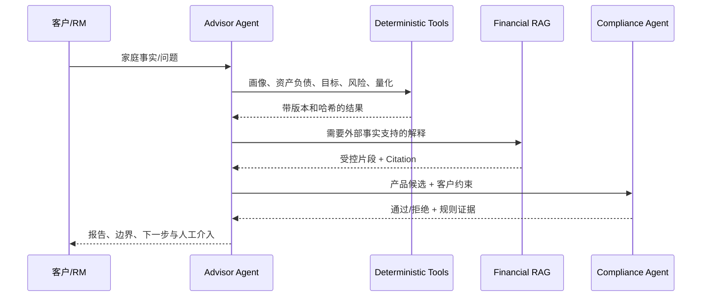

# AI 与 Agent 架构

## 定位

Fortune-Copilot 采用“LLM 负责语言，确定性工具负责金融决策”的受限 Agent 架构。Advisor Agent 是汇总者，不是权重生成器、合规裁判或交易执行器。

## Agent 职责

| Agent | 可做 | 禁止 |
| --- | --- | --- |
| Intake | 提取候选事实、发现缺失项 | 未确认写入权威事实 |
| Profile | 调用画像工具、解释标签 | 自行提高风险等级 |
| Goal | 识别目标类型/日期/金额并追问 | 自行填造学费、通胀、汇率 |
| Scenario | 选择受控压力情景 | 预测市场涨跌 |
| Product Research | 检索受控产品资料 | 覆盖适当性或决定购买金额 |
| Compliance | 执行确定性规则并返回违反项 | 通过提示词豁免硬规则 |
| Behavior | 读取行为证据、解释和干预 | 仅凭一句话给心理诊断 |
| Advisor | 汇总财务、目标、风险、量化、产品、行为和行动 | 修改 Quant 输出 |
| RM Copilot | 生成 NBA 和沟通草稿 | 自动交易或替代持牌人员 |

## 编排顺序

## RAG

知识类型覆盖财富管理、产品、金融知识、适当性、养老金、保险和风险教育。文档带发行机构、版本、发布日期、生效/失效日、适用人群、地区、来源 URI 和快照状态。

检索流程：

1. 只加载受控快照，隔离恶意/过期切片。
2. 按有效期、地区、人群和类别过滤。
3. 字符 n-gram 检索并返回 chunk id。
4. 外部事实声明必须绑定 Citation。
5. 无结果时返回 `insufficient_information`，不以模型常识补写。

评估定义：Recall@K、MRR、Faithfulness、Unsupported Claim Rate。当前 60 画像 benchmark 实测的是合成需求类别命中与声明绑定；Faithfulness 的真实人工评审仍未完成，不能填造。

## Guardrails

- 提示注入和“忽略规则”在模型调用前阻断。
- 外发字段白名单和敏感字段脱敏。
- Agent 工具按角色和任务白名单。
- 数字账本记录来源工具和字段路径。
- 适当性、产品风险、期限、流动性、集中度和最低金额不可由自然语言覆盖。
- Provider 超时或缺 Key 时降级到经 Pydantic 校验的本地模板。

## 可观测性

保存 Agent run、step、tool call、输入/输出引用、耗时、Provider、失败码、Citation、guardrail issue 和最终状态。`llm_modified_quant_output=false` 是比赛主案例的强制审计字段。
