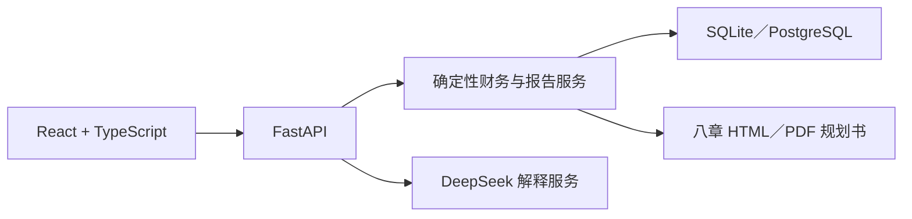

# 智运财富 · 普慧金融

英文名：Fortune Copilot。

面向中国个人与家庭的财富规划产品。客户从家庭情况、客户识别和一张完整财务报表开始，查看资产负债、年度收支和六项家庭财务比率，再录入理财目标与大额支出，最后生成固定八章的理财规划书。

金额、比率、公式代入和规划书数字由确定性程序计算。大语言模型只用于理解、追问和解释已验证结果。

## 产品流程

1. 填写个人／家庭基本情况、资金来源、投资经验与风险承受信息。
2. 录入资产、负债、年收入和年支出。
3. 查看美观的财务报表可视化和六项比率分析。
4. 填写理财目标、大额支出和已准备资金。
5. 生成、阅读、打印或导出八章理财规划书。

## 财务报表口径

### 资产

- 现金、活期存款与货币基金
- 定期存款与银行理财
- 非银行金融资产
- 自住房产
- 投资性房产
- 车辆及其他资产

### 负债

- 房产贷款、车贷和消费贷款余额
- 信用卡未付金额
- 非银行借／贷款与其他负债

信用卡额度不是资产，不进入资产合计。

### 年收入与年支出

- 收入：本人收入、配偶收入、资产生息、出租收入和其他收入。
- 支出：生活费、父母赡养、子女教养、保费、还贷和其他支出。

## 六项家庭财务比率

- 流动比率
- 负债比率
- 结余比率
- 财务负担率
- 投资与净资产比率
- 房产与资产比率

每项都显示计算方式、本次代入、常用参考范围、指标含义、家庭分析和下一步。参考范围是观察标尺，不是对所有家庭适用的统一合格线。

## 中国家庭动态四账户

- 要花的钱：按实际消费习惯准备数千元起的支付和结算资金，信用卡额度不计入资产。
- 保命的钱：保险以消费型保障为主，保障与投资分开。
- 保本的钱：服务应急、个人养老金和五年内目标；参考区间会随家庭目标、资金期限和市场环境调整，账户名称不代表所有产品保证本金。
- 生钱的钱：可规划金融净值达到客户选择的 30万—100万元启动线后进入正式评估；未达线但有正结余、无待处理高息债务、有多余长期资金且通过适当性条件时，可用不超过该多余资金 10% 的小仓位学习宽基指数基金。70% 只针对正式配置中完成前置安排后的长期可规划资源。

普通家庭不默认配置个股、杠杆、股指期货或新增投资性房产。最低工资涨幅只作长期购买力辅助观察，不等同于 CPI。

市场口径来自统一规则，不由客户或大语言模型临时判断。当前演示规则为中性：参考区间 10%—20%，中间参考点 15%。

## 规划书结构

一级目录严格保持八章：

1. 家庭基础情况
2. 理财目标
3. 大额支出计划
4. 理财假设
5. 家庭财务报表
6. 家庭财务比率分析
7. 投资规划建议
8. 免责声明

第 7 章先安排应急储备、偿债、保障、近期目标和长期资金，再按已经确定的金额说明具体基金。客户先看到资金用途、金额和风险，需要时再展开产品资料来源。购买前仍应以工行手机银行当日产品页面和风险测评结果为准。详细规则见 [`docs/fund_advisory.md`](docs/fund_advisory.md)。

## 三类客户案例

首页可直接进入三类已准备客户的完整规划流程：

- 单身职场新人：关注现金储备、结余能力和购房目标。
- 双收入三口之家：关注偿债压力、教育准备和资产集中。
- 临近退休夫妻：关注流动性、退休现金流和医疗安排。

## 技术架构



- 前端：React 19、TypeScript、Vite、ECharts、Phosphor Icons。
- 后端：FastAPI、Pydantic、SQLAlchemy 2、Alembic。
- 计算：Decimal 金额、版本化公式与参考阈值。
- 模型：DeepSeek 的 OpenAI 兼容接口，JSON 输出通过应用自有 Pydantic 模型再次校验。
- 测试：Pytest、Vitest、Testing Library 与 Playwright。

详细产品架构见 [`docs/product/frontend_architecture_v2.md`](docs/product/frontend_architecture_v2.md)，视觉与组件契约见 [`DESIGN.md`](DESIGN.md)，本轮前端审计见 [`docs/design/wealth_planning_product_audit.md`](docs/design/wealth_planning_product_audit.md)。

## 快速启动

需要 Docker Desktop 与 Docker Compose。

```bash
cp .env.example .env
docker compose up --build
```

默认访问：

- 产品首页：http://localhost:18080
- 开始规划：http://localhost:18080/planning
- API 文档：http://localhost:18000/docs
- 健康检查：http://localhost:18000/api/v1/health

### 连接 DeepSeek

在本地 `.env` 配置：

```dotenv
LLM_PROVIDER=deepseek
LLM_API_KEY=填写本地密钥
LLM_BASE_URL=https://api.deepseek.com
LLM_MODEL=deepseek-v4-flash
```

密钥不应写入代码、`.env.example` 或版本库。Docker Compose 会把上述本地变量传入后端。未配置密钥时，金额和比率仍由确定性程序完整计算，解释使用本地模板。

## 本地开发

需要 Python 3.12 与 Node.js 22。

```bash
make setup
make migrate
make seed
```

分别启动两个终端：

```bash
make backend-dev
make frontend-dev
```

## 质量检查

```bash
make check
```

该命令依次执行后端与前端静态检查、类型检查、全量测试和前端生产构建。

## 主要 API

- `POST /api/v1/wealth-planning/cases`：创建客户基本情况与家庭财务报表，返回确定性分析。
- `POST /api/v1/households/{household_id}/ratio-explanations`：对已验证六项比率生成结构化解释。
- `POST /api/v1/households/{household_id}/plan-narrative`：返回确定性四账户结果与八章规划书讲解。
- `POST /api/v1/households/{household_id}/goals`：保存理财目标。
- `POST /api/v1/households/{household_id}/reports`：生成严格八章正式规划书。
- `GET /api/v1/fund-advisory/products`：读取已核验的公开基金资料。
- `GET /api/v1/households/{household_id}/fund-advisory`：生成第七章的具体产品说明。

## 产品边界

- 不把银行理财、信托、基金或保险统一描述为保本产品。
- 不把最低工资变化等同于 CPI。
- 不把某一账户内的比例解释为家庭总资产固定配置。
- 不向普通家庭默认推荐个股、杠杆或股指期货。
- 真实基金建议仍须在执行当日完成工行风险测评、适当性判断、最新产品资料、费率、限购／暂停和账户可售状态复核；官网公开列示不是实时可买保证。
