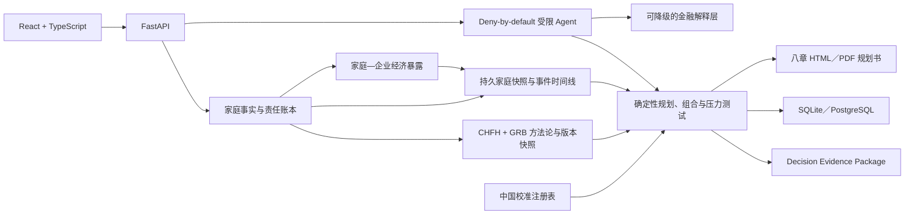

# 智运财富 · 普慧金融

英文名：Fortune Copilot。

**Fortune Copilot 不是基金推荐器，而是面向中国家庭的财务健康规划系统。** 它以 CHFH 中国家庭财富健康理论为总框架，以 GRB（Goal、Risk、Behavior）动态账户模型为配置核心，在家庭生活、刚性责任、保障与近期目标得到安排后，才评估真正长期资金的购买力增长。

客户从家庭情况、客户识别和一张完整财务报表开始，查看资产负债、年度收支和六项家庭财务比率，再录入理财目标与大额支出，最后生成固定八章的理财规划书。

金额、比例、阈值、适当性、产品资格和规划书数字均由确定性程序计算。大语言模型只用于理解、追问和解释已验证结果，无权覆盖硬约束。所有关键结论携带方法论、规则、地区参数、市场状态、养老金政策、产品快照与评估版本，并生成可重演的决策哈希。

> 仓库已加入经官方公开网页核验的 CPI、杭州／南京／广州最低工资和监管政策只读快照；它们不是实时 API。工商银行 IAM、客户数据、AML/CDD、产品、交易、CRM 和内部投研系统仍只有 fail-closed Port/Adapter 契约，未接入、也不伪装接入。

## 项目定位

Fortune Copilot 是竞赛原型与合成数据环境下的中国家庭综合财务规划系统，不是固定比例图，也不是可执行交易的基金推荐器。它先处理家庭安全、责任和目标，再决定是否存在可用于长期增长的资金。

## 产品截图


## 架构速览

家庭事实进入 Financial Graph 后，由确定性 Profile、Need、Liability／ELTC、Twin、CFS、产品闸门、专业路由与 Monitoring 串成同一证据链。语言模型只处理受限理解与解释，关键金额、比率与配置由确定性工具计算。

## 三端演示账号

- 客户端：查看家庭安全、目标缺口、八章规划书与待确认行动。
- 客户经理端：处理 Trigger、变化事实、变化需要、CFS 与建议会谈。
- 合规端：复核适当性、校准边界、决策证据、哈希回放与发布门禁。
- Demo 管理员：只在本地合成环境执行加载、重置、基准与故事链。

## 三分钟演示流程

从 `/demo` 查看八 Persona 清单与 A／B／C 对照，运行 B 的十阶段主剧情，再进入 `/client`、`/advisor` 和 `/risk` 读取同一不可变方案链。E14 另以发布 API 验证九项基准和创始人融资事件的 14 个阶段。

## 合成数据与 Mock 边界

默认环境可在无密钥、无外部模型、无真实银行接口时离线运行。A-H、Golden、基准与实验均为合成或 `internal_demo` 证据，不冒充客户研究、工行系统、实时产品、真实经营效果或投资业绩。

## 风险免责声明与核心边界

- 信用卡可用额度不计入资产，未付余额才进入负债。
- 最低工资不等同 CPI，也不是投资收益门槛。
- 普通家庭默认不推荐个股、杠杆或股指期货。
- “保本的钱”与“稳钱”只描述资金用途和安全偏好，不构成任何产品保本保收益承诺。
- 规划、压力测试与 Golden 回归不预测市场，不替代持牌投资、税务、法律、保险或信托意见。

## 产品流程

1. 填写个人／家庭基本情况、资金来源、投资经验与风险承受信息。
2. 录入资产、负债、年收入和年支出。
3. 查看美观的财务报表可视化和六项比率分析。
4. 填写理财目标、大额支出和已准备资金。
5. 生成、阅读、打印或导出八章理财规划书。
6. 家庭收入等已确认事实发生变化后，查看新快照、前后差异与事件时间线。
7. 家庭持有或依赖企业时，联合查看企业股权、工资／分红、担保、质押和流动性事件对经济风险预算的影响。
8. 客户确认后生成综合财务方案，按需要、原因、行动、金额、风险预算、工具和专业服务查看完整决策链。
9. 只有通过 CFS 产品映射闸门的行动才进入候选比较；无产品、现金保留和专业服务均可作为正式结果。
10. 对养老、外币暴露、家庭延续或公益有明确需要时，再进入对应专业模块；复杂事项通过现有转介链交给专业人员。
11. 家庭事实、责任、风险预算、持仓期限或行为信号出现重大变化时生成复核行动；没有重大变化时正式返回 `NO_ACTION_REQUIRED`。
12. 客户在 `/wealth` 用一页总览判断安全、目标缺口、资金优先级和重规划需要；客户经理在 `/advisor/actions` 按紧急度、期限与专业路由处理同一批触发证据。
13. 需要自然语言协助时，由受限 Intake、Goal、Household／Scenario、Product Research 或 Advisor Copilot 调用各自 Allowlist 中的确定性工具；草稿需确认，产品研究不覆盖适当性，任何 Agent 都不能决定购买金额、提高风险等级或执行交易。

## 财务报表口径

### 资产

- 现金、活期存款与货币基金
- 定期存款与银行理财
- 非银行金融资产
- 自住房产
- 投资性房产
- 车辆及其他资产

### 负债

- 房产贷款、车贷和消费贷款余额
- 信用卡未付金额
- 非银行借／贷款与其他负债

信用卡额度不是资产，不进入资产合计。

### 年收入与年支出

- 收入：本人收入、配偶收入、资产生息、出租收入和其他收入。
- 支出：生活费、父母赡养、子女教养、保费、还贷和其他支出。

## 六项家庭财务比率

- 流动比率
- 负债比率
- 结余比率
- 财务负担率
- 投资与净资产比率
- 房产与资产比率

每项都显示计算方式、本次代入、常用参考范围、指标含义、家庭分析和下一步。参考范围是观察标尺，不是对所有家庭适用的统一合格线。

## 中国家庭动态四账户

- 要花的钱：按实际消费习惯准备数千元起的支付和结算资金，信用卡额度不计入资产。
- 保命的钱：保险以消费型保障为主，保障与投资分开。
- 保本的钱：服务应急、个人养老金和五年内目标；参考区间会随家庭目标、资金期限和市场环境调整，账户名称不代表所有产品保证本金。
- 生钱的钱：先从可调度金融资源依次扣除日常周转、应急、高息债务、保障、近期刚性责任、已承诺目标资本和锁定制度资产，得到长期可配置资本 ELTC；只有 ELTC 为正且适当性、债务和现金流安全门同时通过，才进入正式长期配置。原 30万—100万元地区启动线只保留为沟通参考，不再决定资格。

普通家庭不默认配置个股、杠杆、股指期货或新增投资性房产。最低工资涨幅只用于收入充足度辅助观察，不等同于 CPI，也不进入投资收益门槛。

## CHFH、GRB、CHFI 与 HFDT

- CHFH 将决策主体从单个投资者扩展为家庭，联合观察资产、负债、现金流、保障、制度账户、目标、风险和行为。
- GRB 用目标期限与刚性、风险承担能力与意愿、真实行为反馈共同决定四账户，不只读取一次风险问卷。
- CHFI 以十个维度做家庭财务健康诊断，采用可用维度归一化后的几何平均，强项不能抵消现金流、偿债或保障短板。它不是征信评分。
- HFDT 家庭金融数字孪生使用可复现压力情景检验失业、医疗支出、市场下跌和家庭责任变化下的财务韧性，不预测市场涨跌。

V5 将“当前家庭状态”与“压力场景模拟”分开：Persistent Financial Twin 持久保存已确认事实、画像、需求、责任和 ELTC 的版本快照，原 Twin Simulator 可以任一历史快照为初始状态做场景分析。已确认事件按哈希幂等处理，重放不会重复修改家庭事实。

Family–Enterprise Financial Twin 进一步把未上市企业股权、上市雇主股、股权激励、工资／分红、担保、质押和企业流动性事件放入家庭经济财富。Enterprise–Household Dependency Score 只用于规划暴露识别，不是监管评级、征信评分或企业估值结论；证券账户股票少也不会被机械解释为权益风险低。

CFS Composer 把家庭需要、责任流、ELTC、保障缺口与家企暴露合成可版本方案。家庭风险预算联合能力、意愿、行为、现有经济暴露、流动性、刚性责任和期限，不是单一 R1–R5 标签。未通过前置门时，`NO_ACTION_REQUIRED` 是正式建议，系统不会用 0 元组合或产品占位伪装成投资方案。

Buy-side Product Ontology 在 CFS 之后统一产品分类、证据快照、客户资格和候选排序。公开列示、当日可售和交易授权分开表达；快照过期后只能用于教育比较。渠道激励不会提高排名，缺失全口径费用会扣分并阻止执行。

Specialized CFS 在综合方案触发后展开养老收入底线、原币种暴露、家庭照护／延续与公益目标。它只识别需要、缺口和资料来源；法律、税务、外汇交易、信托设立与专业结论仍由受控转介承接。没有对应需要时不显示专业入口，年轻单身家庭不会被默认导向信托产品。

Continuous Monitoring 以 11 类版本化策略复核目标准备度、ELTC、风险预算、资产集中、家企依赖、币种责任、产品到期、快照时效、退休缺口、生活事件和行为漂移。Next Best Action 只输出复核、教育、冷静期或专业转介；所有监控动作均标记 `do_not_sell`，产品到期不自动替代，市场上涨不触发热门基金追涨。

Bounded Financial Agents 复用既有编排运行和步骤证据表，通过 deny-by-default Tool Registry 限定每个 Agent 的读取与草稿权限。Intake 不写未确认事实，Goal 不猜学费、通胀或汇率，Scenario 只选受控目录，Product Research 只返回事实、差异和证据，Advisor Copilot 只准备会谈材料。

China Calibration Layer 把 HCI、GCI、IAI 的参数统一登记为 Parameter ID、来源、版本、方法、置信度与限制，并严格区分 `controlled_demo`、`empirically_calibrated` 和 `bank_authorized`。当前只有受控演示规则与经核验公开快照，尚无银行授权数据；缺失参数会显示降级／待复核，不会静默猜测或冒充银行结论。

系统形成 `CHFH → GRB → 动态四账户 → CHFI → HFDT → 产品适当性 → 持续复盘` 的单一主线。RRI-G 的责任、韧性和制度覆盖能力保留为内部约束组件，不再作为对外独立方法论品牌。

市场口径来自统一规则，不由客户或大语言模型临时判断。当前演示规则为中性：参考区间 10%—20%，中间参考点 15%。

V4 的完整定义与边界见：

- [`中国家庭财富框架`](docs/methodology/china_household_wealth_framework.md)
- [`Deep Research 报告吸收与原则校准`](docs/methodology/deep_research_alignment.md)
- [`四域责任瀑布`](docs/methodology/four_domain_responsibility_waterfall.md)
- [`中国家庭购买力门槛 PPH`](docs/methodology/purchasing_power_hurdle.md)
- [`Fortune Copilot V4 架构`](docs/architecture/fortune_copilot_v4.md)
- [`Fortune Copilot V5 执行架构`](docs/architecture/fortune_copilot_v5_execution_architecture.md)
- [`V5 动态客户财富画像与财富需求图谱`](docs/architecture/v5_client_profile_and_needs.md)
- [`V5 责任现金流、ELTC 与购买力 V2`](docs/architecture/v5_liability_streams_eltc.md)
- [`V5 持久家庭财富孪生与事件账本`](docs/architecture/v5_persistent_financial_twin.md)
- [`V5 家庭—企业财富孪生`](docs/architecture/v5_family_enterprise_twin.md)
- [`V5 家庭综合财务方案与 Wealth Orchestrator`](docs/architecture/v5_cfs_and_wealth_orchestrator.md)
- [`V5 买方产品本体、资格与候选排序`](docs/architecture/v5_product_ontology.md)
- [`V5 Specialized CFS：养老、币种、家庭延续与公益`](docs/architecture/v5_specialized_cfs.md)
- [`V5 持续监控、行为观察与 Next Best Action`](docs/architecture/v5_monitoring_next_best_action.md)
- [`V5 家庭财富总览与顾问行动中心`](docs/architecture/v5_frontend_dashboard_action_center.md)
- [`V5 受限工具型金融 Agent`](docs/architecture/v5_bounded_financial_agents.md)
- [`V5 中国购买力校准层`](docs/calibration/china_purchasing_power_calibration.md)
- [`V4 / V5 兼容契约`](docs/architecture/v4_v5_compatibility.md)
- [`决策证据治理`](docs/governance/decision_evidence.md)
- [`Personal Pension Copilot`](docs/product/personal_pension.md)
- [`工行生产集成端口与边界`](docs/integrations/icbc_production_ports.md)
- [`权威公共数据管道`](docs/governance/authoritative_public_data.md)
- [`模型生命周期与监控`](docs/governance/model_lifecycle_monitoring.md)
- [`生产就绪、SRE 与灾备`](docs/operations/production_readiness.md)

## 规划书结构

一级目录严格保持八章：

1. 家庭基础情况
2. 理财目标
3. 大额支出计划
4. 理财假设
5. 家庭财务报表
6. 家庭财务比率分析
7. 投资规划建议
8. 免责声明

第 7 章先安排应急储备、偿债、保障、近期目标和长期资金，再按已经确定的金额说明具体基金。客户先看到资金用途、金额和风险，需要时再展开产品资料来源。购买前仍应以工行手机银行当日产品页面和风险测评结果为准。详细规则见 [`docs/fund_advisory.md`](docs/fund_advisory.md)。

## 八类 V5 Persona 与旧三家庭对照

默认合成数据集使用同一 Canonical 模型覆盖八类异构情形：

- A 刚工作的个人／新市民；B 上海双职工中产家庭；C 高收入专业人士；D 科创企业创始人。
- E 科创专家／科学家与股权激励；F 多代际高净值家族；G 跨境家庭；H 退休家庭。
- 八类 Persona 都依次运行 Profile、Need、Liability、ELTC、Financial Twin、CFS、产品闸门、专业路由与 Monitoring，不按 Persona 代码分叉业务逻辑。
- `/demo` 仍保留 A／B／C 三家庭动态配置对照，作为 V4 现场剧情和反固定比例证据；它不是完整 V5 数据集的数量说明。

结构性 Golden Outcomes 只约束状态、类型、门禁、告警与专业路由，不锁死最终规划金额。Release Benchmark V2 以九项指标检查画像完整度、需求覆盖、CFS 覆盖、无行动正确性、产品排序冲突独立性、顾问触发精度、无效告警率、决策回放和财务正确性。详见 [`docs/architecture/v5_heterogeneous_persona_release.md`](docs/architecture/v5_heterogeneous_persona_release.md)。

## 技术架构



- 前端：React 19、TypeScript、Vite、ECharts、Phosphor Icons。
- 后端：FastAPI、Pydantic、SQLAlchemy 2、Alembic。
- 计算：Decimal 金额、PFNW、三分母、地区化启动线、PPH 与版本化规则快照。
- 模型：DeepSeek 的 OpenAI 兼容接口，JSON 输出通过应用自有 Pydantic 模型再次校验。
- 测试：Pytest、Vitest、Testing Library 与 Playwright。

详细产品架构见 [`docs/product/frontend_architecture_v2.md`](docs/product/frontend_architecture_v2.md)，视觉与组件契约见 [`DESIGN.md`](DESIGN.md)，本轮前端审计见 [`docs/design/wealth_planning_product_audit.md`](docs/design/wealth_planning_product_audit.md)。

## 快速启动

需要 Docker Desktop 与 Docker Compose。

```bash
cp .env.example .env
docker compose up --build
```

默认访问：

- 产品首页：http://localhost:18080
- 开始规划：http://localhost:18080/planning
- API 文档：http://localhost:18000/docs
- 健康检查：http://localhost:18000/api/v1/health

### 连接 DeepSeek

在本地 `.env` 配置：

```dotenv
LLM_PROVIDER=deepseek
LLM_API_KEY=填写本地密钥
LLM_BASE_URL=https://api.deepseek.com
LLM_MODEL=deepseek-v4-flash
```

密钥不应写入代码、`.env.example` 或版本库。Docker Compose 会把上述本地变量传入后端。未配置密钥时，金额和比率仍由确定性程序完整计算，解释使用本地模板。

## 本地开发

需要 Python 3.12 与 Node.js 22。

```bash
make setup
make migrate
make seed
```

分别启动两个终端：

```bash
make backend-dev
make frontend-dev
```

## 质量检查

```bash
make check
```

该命令依次执行后端与前端静态检查、类型检查、全量测试和前端生产构建。

## 主要 API

- `POST /api/v1/wealth-planning/cases`：创建客户基本情况与家庭财务报表，返回确定性分析。
- `POST /api/v1/households/{household_id}/ratio-explanations`：对已验证六项比率生成结构化解释。
- `POST /api/v1/households/{household_id}/plan-narrative`：返回确定性四账户结果与八章规划书讲解。
- `POST /api/v1/households/{household_id}/goals`：保存理财目标。
- `POST /api/v1/households/{household_id}/reports`：生成严格八章正式规划书。
- `GET /api/v1/fund-advisory/products`：读取已核验的公开基金资料。
- `GET /api/v1/households/{household_id}/fund-advisory`：生成第七章的具体产品说明。
- `GET /api/v1/households/{household_id}/liability-calendar`：读取由目标与责任生成的日期化现金流日历。
- `POST /api/v1/households/{household_id}/liability-streams`：在明确确认后新增自定义责任流。
- `GET /api/v1/households/{household_id}/eligible-capital`：读取 ELTC 扣减桥、资格门和购买力 V2 指标。
- `GET /api/v1/calibration/catalog`：读取受控演示、经验校准与银行授权三种模式的可用性和数据集来源。
- `GET /api/v1/calibration/parameters/{code}`：按参数、分群、地区、日期与可选模式解析校准值；缺失时返回 `needs_review`。
- `GET /api/v1/households/{household_id}/wealth-twin`：读取或幂等生成家庭当前持久快照与前后差异。
- `POST /api/v1/households/{household_id}/life-events`：在显式确认后幂等应用家庭生活事件并重算快照。
- `GET /api/v1/households/{household_id}/event-timeline`：读取已确认事件的生效时间、记录时间、财务影响与目标快照。
- `GET /api/v1/households/{household_id}/wealth-twin/snapshots/{snapshot_id}`：读取家庭边界内的指定历史快照。
- `POST /api/v1/households/{household_id}/enterprises`：在显式确认后建立家庭关联企业与金融图实体。
- `POST /api/v1/households/{household_id}/enterprise-exposures`：确认股权、估值、企业收入、担保和流动性事件，并生成事件账本与新快照。
- `GET /api/v1/households/{household_id}/family-enterprise-view`：读取家企财富、五维依赖度、经济权益风险预算与 CFS 约束。
- `POST /api/v1/households/{household_id}/cfs-solutions`：在客户显式确认后生成并版本化综合财务方案。
- `GET /api/v1/households/{household_id}/cfs-solutions/{solution_id}`：在家庭对象边界内回读已保存的方案、风险预算、工具路由和转介。
- `POST /api/v1/households/{household_id}/cfs-solutions/{solution_id}/recalculate`：核对当前快照，事实不变时幂等返回原方案。
- `POST /api/v1/households/{household_id}/professional-referrals`：在显式确认后建立受控专业服务转介。
- `GET /api/v1/products/search`、`GET /api/v1/products/{product_id}`：查询产品本体与最新证据快照。
- `POST /api/v1/products/eligibility-check`、`POST /api/v1/products/rank`：执行确定性资格闸门与买方候选排序。
- `GET /api/v1/households/{household_id}/cfs-solutions/{solution_id}/product-candidates`：把每个 CFS 组件映射为 0—N 个产品候选。
- `GET /api/v1/decisions/{decision_id}/evidence`：读取 Recommendation、PlanReport 或审批版本绑定的 14 域 Decision Evidence V2。
- `POST /api/v1/decisions/{decision_id}/replay`：只用冻结快照重算决策哈希，不读取今天的产品资料。
- `GET /api/v1/households/{household_id}/retirement-plan`：读取退休责任、制度权益、收入底线和长寿／流动性缺口。
- `GET /api/v1/households/{household_id}/currency-exposures`：按原币读取资产、收入、负债、教育、企业和未来责任暴露。
- `GET /api/v1/households/{household_id}/trust-succession-needs`：读取证据触发的家庭照护、延续与专业复核需要。
- `GET /api/v1/households/{household_id}/philanthropy-goals`：读取客户明确表达的公益预算、方向和治理偏好。
- `GET /api/v1/households/{household_id}/monitoring/alerts`：读取版本化策略触发的客户影响、证据与处理状态。
- `POST /api/v1/households/{household_id}/monitoring/evaluate`：在顾问／管理员明确确认后执行 11 类持续监控。
- `GET /api/v1/households/{household_id}/behavior-interventions`：读取复用现有行为干预表的教育与冷静期记录。
- `GET /api/v1/households/{household_id}/next-best-actions`：读取非销售型客户行动或正式 `NO_ACTION_REQUIRED`。
- `GET /api/v1/advisor/action-center`：读取顾问／合规角色可见的监控触发与既有 ActionItem 绑定。
- `GET /api/v1/public-data/authoritative-snapshot`：读取带官方来源、版本和完整性哈希的公共数据快照。
- `GET /api/v1/integrations/readiness`：查看银行专有能力、审批和运维证据缺口。
- `GET /api/v1/health/live`、`GET /api/v1/health/ready`：存活与环境感知的就绪探针。
- `POST /api/v1/security/model-governance/evaluate`：对汇总漂移、公平性、可用性与独立验证状态执行确定性门禁。
- `POST /api/v1/demo/v5/release-benchmark`：管理员确认后只重置合成数据，并对 A-H 运行九项 V5 发布基准。
- `POST /api/v1/demo/v5/founder-story`：管理员确认后运行创始人融资事件的 14 阶段证据链。

## 产品边界

- 不把银行理财、信托、基金或保险统一描述为保本产品。
- 不把最低工资变化等同于 CPI。
- 不把某一账户内的比例解释为家庭总资产固定配置。
- 不向普通家庭默认推荐个股、杠杆或股指期货。
- 不把 Enterprise–Household Dependency Score 解释为监管评级、征信评分、授信结论或企业估值意见。
- 不把计划 IPO、解禁或股权出售当作已到账现金，也不伪造实时企业估值或汇率。
- 不用 0 元组合替代正式 `NO_ACTION_REQUIRED`，也不在 E06 前置责任或 E07 产品资格未通过时生成交易动作。
- 真实基金建议仍须在执行当日完成工行风险测评、适当性判断、最新产品资料、费率、限购／暂停和账户可售状态复核；官网公开列示不是实时可买保证。
- Decision Evidence 回放只证明历史冻结包完整，不表示历史产品在今天仍适合、可售或已获交易授权。
- 养老、币种、家庭延续和公益页面不提供法律、税务、汇率、遗嘱、信托设立或收益承诺；专业转介也不等于意见已经完成。
- Next Best Action 不是 Next Best Sale；市场变化、行为偏差或产品到期均不得自动生成申购、替代产品或交易动作。
