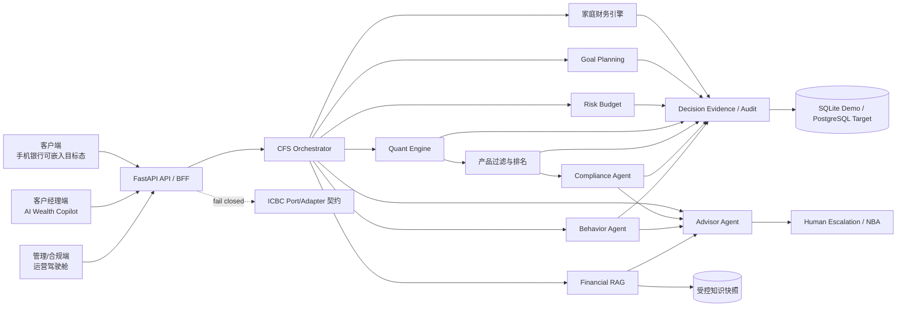

# Fortune-Copilot 系统架构

版本：v0.15.0

## 总体架构

## 核心原则

- 确定性优先：金额、比率、目标、风险预算、权重、适当性和再平衡由程序计算。
- LLM 受限：只做理解、追问、检索辅助和对已验证结果的表达，不写入权威数字。
- 买方顺序：先家庭安全与目标，再资产类别，再产品，再合规。
- 同一证据链：客户端、RM 端和管理端读取同一输入哈希、规则版本和输出哈希。
- Fail closed：知识不足、产品不适配、银行接口未连接或审计失败时不生成可执行建议。

## 分层

| 层 | 组件 | 职责 |
| --- | --- | --- |
| 体验层 | React 客户/RM/风险/比赛页 | 展示、确认、人工复核，不重算金融结果 |
| API 层 | FastAPI + Pydantic | 鉴权、对象授权、契约、错误包络、限流 |
| 编排层 | CFS/Wealth/Agent Orchestrator | 顺序控制、工具白名单、证据汇总 |
| 确定性引擎 | Financial/Goal/Risk/Quant/Compliance/Behavior | 计算和规则决策 |
| 知识层 | 受控 RAG | 文档有效期、适用范围、检索和 Citation |
| 治理层 | Evidence/Replay/Quality Gate | 哈希、版本、审计、报告发布门禁 |
| 数据层 | SQLAlchemy/Alembic/JSON Seed | 关系事实、快照、规则、Mock 产品、知识 |
| 集成层 | Ports/Adapters | 工行目标接口；当前未连接生产 |

## 一次 CFS 请求

1. 加载已确认 Personal/Family/Income/Expense/Asset/Liability/Insurance/Goal/Holding。
2. 计算 Family Balance Sheet、现金流、健康度和动态四账户。
3. 按目标优先级协调月度结余，计算 FV、Required Saving、Gap、Probability。
4. 分离 Risk Capacity、Tolerance、Requirement，形成硬风险预算。
5. Quant Engine 在同一约束下比较四方法并保存输入、可行域、输出和哈希。
6. 资产类别权重进入产品过滤、适当性、排名和组合构建。
7. Compliance Agent 终检；失败候选保留拒绝证据但不进入建议。
8. Behavior Agent 输出证据和干预；RAG 为外部事实绑定 Citation。
9. Advisor 汇总，Human Escalation 决定是否触发客户经理。

## 部署拓扑

- 比赛：Nginx 静态前端 + FastAPI + SQLite volume + `/seed-data` 只读挂载，无外网依赖。
- 试点目标：API 网关 + IdP + PostgreSQL + 对象存储 + 规则/知识发布流水线 + SIEM。
- 生产目标：域隔离、双人复核、密钥托管、数据分级、灾备、模型网关、银行级监控。

当前 Docker 是竞赛部署，不是银行生产部署证明。
