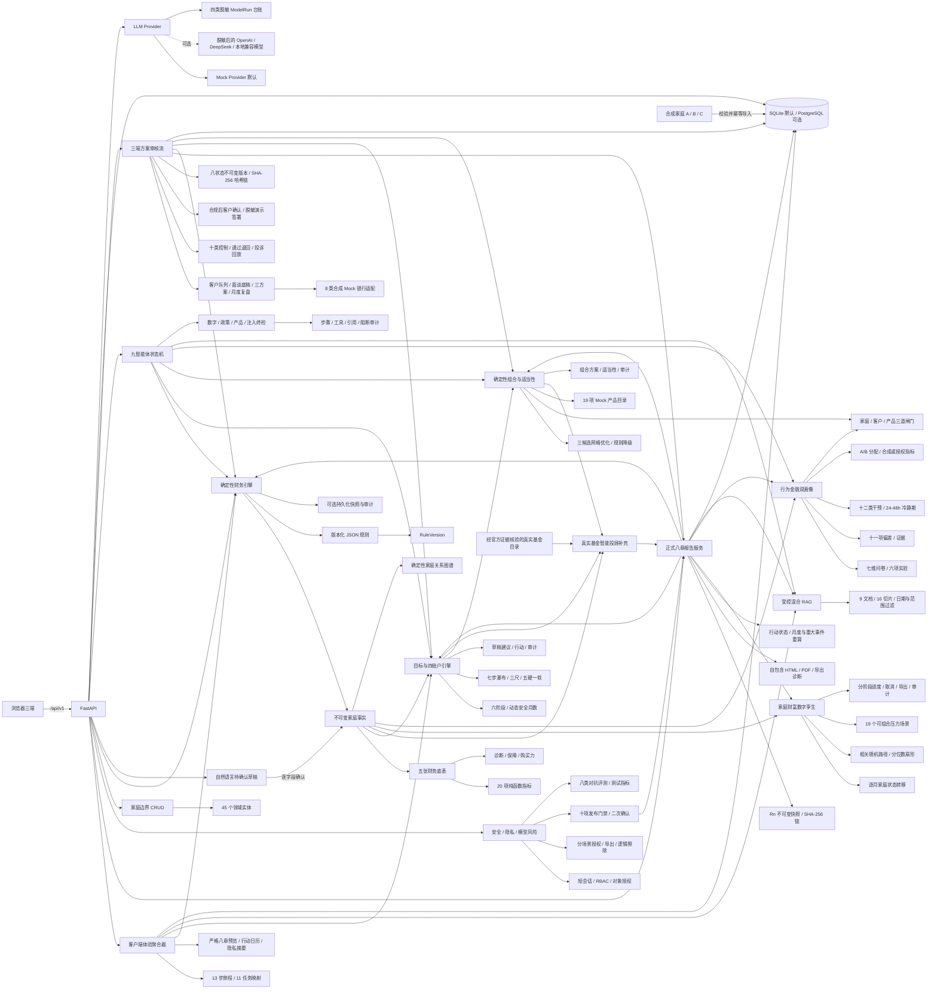

# Fortune Copilot 架构

## 架构目标

系统需要在无外部模型、无真实银行接口、无 PostgreSQL 和无网络时完成主 Demo，同时保证关键金额、比率、配置和压力测试可复现、可解释、可审计。

## Monorepo

| 路径 | 职责 |
| --- | --- |
| frontend | React、TypeScript、Vite 三端应用和设计系统 |
| backend | FastAPI、领域模型、CRUD／种子服务、数据库迁移、Provider 和后端测试 |
| docs | 架构、领域、设计、合规、进度和比赛材料 |
| data | 版本化合成家庭、财务／规划／组合／孪生／行为规则、Mock 产品、受控政策知识、可信 AI 基准与标准答案 |

## 运行拓扑



Docker Compose 默认只启动 frontend 和 backend。后端使用持久化 SQLite 与 Mock LLM；PostgreSQL 放在显式 postgres profile 中，不是主 Demo 的前置依赖。

## 后端分层

1. API：只处理协议、Schema 校验、认证依赖、四角色最小权限和请求 ID。
2. Core：配置、数据库、脱敏日志、签名会话、对象授权、外部模型字段白名单、请求体／速率／Origin／安全头和统一错误模型。
3. Domain/Models：45 个实体承载家庭、财务、目标、组合、适当性、行为实验、知识切片、录入草稿、智能体运行、方案审核版本、身份授权映射、隐私请求、评测、发布门禁、完整 Demo 与实验套件审计事实；统一 Decimal、币种、估值日、来源、确认状态、版本和软删除。
4. Services：已实现事实装载、五表、诊断、保障、购买力、20 项指标、目标投影、生命周期、动态四账户、反事实、组合优化、产品映射、三道适当性闸门、逐月家庭状态、Monte Carlo、压力组合、可取消分阶段运行、行为双画像、偏差证据、干预／冷静期、A/B 指标、混合 RAG、关系图谱、待确认录入、九智能体状态机、反幻觉终检、隐私导出／逻辑擦除、模型风险台账、对抗评测、十项发布门禁、八类 Mock 银行投影，以及复用这些结果的客户端旅程、三端不可变审核流、正式八章快照、行动重算链、HTML/PDF 渲染和十阶段发布 Demo／七项实验编排。
5. Provider：Mock、OpenAI 兼容与可扩展本地兼容传输统一使用 JSON Schema／Pydantic；语言模型只能理解、追问和解释，禁止计算关键金融数字。

当前阶段已经实现 API、Core、完整领域 Models、家庭边界 CRUD、合成数据服务、确定性财务引擎、目标与四账户引擎、组合适当性引擎、家庭财富数字孪生、行为金融双画像与干预引擎、受控知识／图谱／九智能体治理、LLM Provider、隐私权利和安全发布门禁。GET 分析、组合候选、知识目录与图谱不产生业务方案副作用；录入确认、智能体运行、行为会话、隐私权利、质量评测与发布是显式写操作，并逐项保存去标识审计事件。

## API 约定

- 基础路径：/api/v1
- OpenAPI：/api/v1/openapi.json
- 交互文档：/docs
- 健康检查：GET /api/v1/health
- 能力清单：GET /api/v1/meta/capabilities
- 家庭根资源：`/api/v1/households`
- 家庭嵌套资源：members、assets、liabilities、incomes、expenses、insurance-policies、goals、risk-assessments、consents
- 财务分析：GET `/households/{id}/financial-analysis`、`/statements`、`/metrics`、`/diagnostics`
- 结果导出：GET `/households/{id}/financial-analysis/export`
- 保存运行：POST `/households/{id}/financial-analysis/runs`
- 目标与四账户：GET `/households/{id}/planning`
- 反事实：POST `/households/{id}/planning/counterfactual`
- 规划导出：GET `/households/{id}/planning/export`
- 规划草稿：POST `/households/{id}/planning/runs`
- Mock 产品目录：GET `/portfolio/products`
- 三候选与闸门：GET `/households/{id}/portfolio`
- 主动适当性检查：POST `/households/{id}/portfolio/suitability-check`
- 组合导出：GET `/households/{id}/portfolio/export`
- 组合草稿：POST `/households/{id}/portfolio/runs`
- 经核验真实基金目录：GET `/fund-advisory/products`
- 默认工行限定的真实基金投顾补充：GET `/households/{id}/fund-advisory`
- 压力场景目录：GET `/twin/scenarios`
- 孪生运行：POST `/households/{id}/twin/runs`
- 推进／读取／取消：POST `/households/{id}/twin/runs/{run_id}/advance`、GET 同一运行路径、POST `.../cancel`
- 孪生导出：GET `/households/{id}/twin/runs/{run_id}/export`
- 行为规则与 A/B：GET `/behavior/catalog`、GET `/behavior/ab-framework`
- 行为画像与导出：GET `/households/{id}/behavior`、GET `/households/{id}/behavior/export`
- 行为会话：POST `/households/{id}/behavior/sessions`、GET `/households/{id}/behavior/sessions/{session_id}`
- 行为选择／完成／退出：POST `.../responses/{experiment_code}`、POST `.../complete`、POST `.../exit`
- 干预操作：POST `/households/{id}/behavior/interventions/{intervention_id}/actions`
- 受控知识：GET `/trust/knowledge/catalog`、POST `/trust/knowledge/search`
- 关系图谱：GET `/trust/graphs/shanghai-demo`、GET `/households/{id}/trust-graph`
- 待确认录入：POST `/trust/intake/drafts`、GET `/trust/intake/drafts/{draft_id}`、POST `.../confirm`
- 九智能体：GET `/trust/agents/catalog`、POST `/households/{id}/trust-orchestrations`、GET 最新／指定运行
- 反幻觉终检：POST `/trust/governance/validate`
- 客户端聚合：GET `/households/{id}/client-experience`（含不泄露内部草稿的 report／workflow／actions 交付状态）
- 客户端数据包：POST `/households/{id}/privacy/exports`（会话、对象权限与二次确认；旧 GET 只作非生产兼容）
- 授权撤回：POST `/households/{id}/privacy/consents/{consent_id}/withdraw`
- 逻辑擦除：POST `/households/{id}/privacy/deletion-requests`
- 人工复核：POST `/households/{id}/privacy/human-review-requests`
- 顾问客户队列：GET `/advisor/households`
- 面谈底稿与 Mock 接口：GET `/households/{id}/advisor-dossier`、GET `/households/{id}/mock-bank-snapshot`
- 方案工作流：POST `/households/{id}/plan-workflows`、GET `/households/{id}/plan-workflows/current`、GET `/plan-workflows/{workflow_id}`、POST `/plan-workflows/{workflow_id}/actions`
- 合规审核：GET `/compliance/review-queue`、GET `/plan-workflows/{workflow_id}/compliance-evidence`
- 投诉与审计：POST `/plan-workflows/{workflow_id}/complaint-replays`、GET `/plan-workflows/{workflow_id}/audit-export`
- 正式报告：GET `/households/{id}/reports/current`、POST `/households/{id}/reports`、POST `/households/{id}/reports/recalculate`
- 报告行动：GET `/households/{id}/report-actions`、POST `/households/{id}/report-actions/{action_code}`
- 报告版本与导出：GET `/households/{id}/reports/generation-chain`、GET `/reports/{report_id}`、GET `/reports/{report_id}/html|pdf`
- 安全会话与授权目录：POST `/security/demo-sessions`、GET `/security/privacy/consent-catalog`
- 上传检查与模型台账：POST `/security/document-inspections`、GET `/security/model-runs`
- 安全评测：POST `/security/evaluations/run`、GET `/security/dashboard`
- 报告发布：POST `/reports/{report_id}/quality-gate`、POST `/reports/{report_id}/publish`
- 完整 Demo：GET `/demo/manifest`、POST `/demo/load|reset|preheat`、GET `/demo/families/comparison`、POST／GET `/demo/runs`、POST `/demo/runs/{id}/retry`
- 发布实验：POST `/demo/experiments/run`、GET `/demo/experiments/latest`
- 请求跟踪：客户端可传 X-Request-ID，服务端缺失时生成并回传。
- 身份与权限：角色为 client／advisor／compliance／admin；签名 Bearer 短会话携带允许家庭，家庭路径和 ID 路径都做对象授权。`X-Actor-ID` 与 `X-Actor-Role` 只在 development／demo／test 开启，production 强制关闭。
- 列表统一分页；更新和软删除要求当前 `expected_version`，过期版本返回 409。

错误响应统一为：

```json
{
  "error": {
    "code": "validation_error",
    "message": "请求数据校验失败",
    "request_id": "...",
    "details": []
  }
}
```

日志只记录事件元数据和请求 ID，不记录完整财务载荷、密钥或敏感身份信息。校验错误也不回显被拒绝的原始输入。

## 前端架构

- 本地 History Router 提供 /、/demo、/client、/advisor、/risk 与 404，不引入服务端路由或 RSC 依赖。
- AppShell 统一品牌边界、三端导航、运行模式和离线提示。
- frontend/src/styles/tokens.css 是 DESIGN.md 的工程化映射。
- 三端通过 data-density 共享组件但使用不同密度。
- API 不可达时使用前端本地能力清单，只展示工程状态和合规边界，不伪造财务数据。
- 客户端按“目标与四账户 → 家庭总览 → 五张底表 → 指标账本 → 保障／购买力 → 数据诊断”组织；任何指标均可进入公式审计抽屉。
- 规划工作台包含目标录入、时间轴、冲突组合、金额／三种分母切换、七步瀑布、五硬一软、反事实和行动草案；前端只展示后端比例，不自行重算。
- 组合工作台使用横向候选比较矩阵与纵向证据账本，展示资产类别和产品类型两层、三道闸门、优化／降级状态、有限战术情景和再平衡；普通家庭路径不提供个股、杠杆或股指期货操作。
- 顾问端可比较候选并保存组合草稿；风险端可运行五类适当性对抗探针并取得审计事件 ID。
- 三端共享数字孪生工作台：客户端解释路径与家庭目标，顾问端比较原／优化反事实，风险端默认展开 seed、版本、参数哈希、数值校验和审计事件；计算可显示进度并取消。
- 三端共享行为金融工作台：客户端完成七维问卷和六项实验，顾问端对照说法／选择／客观能力，风险端默认展开十一项偏差证据、冲突、干预记录与四组 A/B 指标；行为只能维持或下调客观风险上限。
- 三端共享可信 AI 工作台：受控政策引用显示发布／生效／核验日期和来源；客户端／顾问端逐字段确认自然语言草稿；五列关系图提供等价数据表；风险端只有在真实运行后才展示九步工具调用、Schema、禁令、数字账本和终检状态。
- 净资产预测使用 P10／P25／P50／P75／P90 扇形图，不用单根上升曲线；图表固定显示标题、口径、期限、单位、路径数、seed、来源、文字结论、读屏摘要和精确数据表。
- 雷达图只把后端确定性指标归一化为辅助视图，并明确标注非监管评级；颜色始终辅以文字。
- ErrorBoundary 提供可恢复的全局错误状态；客户端已经覆盖 Loading、Error、Offline、NotApplicable 与保存反馈。
- 客户端以 11 项具名任务承载 13 步旅程；任务 tab 支持方向键／Home／End，A／B／C 切换会重载各自事实、图表、报告摘要和行动。
- `ChartFrame` 统一 ECharts SVG 图表的标题、口径、单位、时间、来源、结论、读屏图名、Loading／Empty／Error 和精确数据表；图表本地打包，不依赖 CDN。
- 显示偏好由共享 Context 驱动深色、大字、低金融知识、金额遮罩、金额／比例和元／万元；遮罩会卸载敏感工作区，不把金额留在辅助技术树。
- 客户端正式报告的一级目录严格为八章；无正式快照时才显示 Stage 9 确定性预览。行动日历固定五组并包含未来 12 个月复盘，状态持久化后生成新报告快照；隐私中心使用分场景授权、可审计 POST 导出与三重确认逻辑擦除，不使用前端假动作。
- 顶栏可切换四个模拟账号并真实改变工作流请求头；路由默认选择对应最小角色，越权状态提供原因和演示切换入口。
- 顾问端以客户队列、面谈底稿、三方案矩阵、产品理由、风险流动性、8 类 Mock 接口、可编辑沟通稿、版本链和 12 月复盘为主任务；旧技术工作区折叠为证据附录。
- 风险端以待审队列、十类控制、治理版本、通过／退回／人工复核、投诉回放、审计导出、安全测试指标和报告发布门禁为主任务；所有评测指标显式标记为测试，客户端只在合规通过后加载同一裁剪版本并逐项确认。
- 顾问端读取正式报告当前版、八章目录和 HTML/PDF 导出；风险端读取报告父子哈希链与九类版本证据。合规前 `workflow_linked` 报告不会进入客户端可访问树。

## 数据与迁移

- SQLAlchemy 2.x 使用统一 DeclarativeBase。
- Alembic 是数据库结构唯一迁移路径。
- 默认 DATABASE_URL 为 SQLite；将其替换为 PostgreSQL URL 即可使用 psycopg。
- `0001_bootstrap` 创建运行元数据表；`0002_domain_models` 增量创建 28 个领域表；`0003_financial_engine` 增加财务引擎字段；`0004_dynamic_planning` 扩展动态账户；`0005_portfolio_suitability` 扩展 Product／PortfolioPlan，新增 SuitabilityCheck 和 AuditEvent 证据字段；`0006_wealth_twin_simulation` 扩展 ScenarioDefinition／SimulationRun；`0007_behavior_finance` 新增行为会话、响应、偏差发现、干预和 A/B 分配 5 张表；`0008_trusted_ai` 非破坏扩展 PolicyDocument，并新增 KnowledgeChunk、IntakeDraft、AgentOrchestrationRun 和 AgentStepRun 4 张表；`0009_review_workflow` 新增不可变审核链；`0010_formal_reports` 扩展 PlanReport 与 ActionItem；`0011_report_uniqueness` 约束家庭内报告序号和行动代码唯一；`0012_security_privacy_quality` 新增 IdentityAccessGrant、PrivacyRequest、QualityGateRun、EvaluationRun，并为 PlanReport 增加发布状态、时间和门禁引用；`0013_demo_release` 新增 DemoRun 与 ExperimentSuiteRun。当前为 45 个领域实体，加 runtime_metadata 为 46 张应用表。
- 货币持久化为 `Numeric(20, 2)`，Python 与 API 契约使用 Decimal；API 接受十进制字符串或整数并拒绝 JSON 浮点金额。
- 普通查询排除软删除记录；更新和删除递增版本。数据库外键负责物理级联，业务 API 默认不执行硬删除。
- 所有成员、资产等引用在写入前验证属于当前家庭，避免跨家庭串联。
- `plan_reports` 使用数据库检查约束固定八章一级结构，并由 `FormalReportDocument` 再校验八个章节名称与顺序；household + sequence 唯一，父快照与报告哈希形成只追加生成链，旧报告不会被新重算覆盖。
- `plan_reports` 只有在十项 `QualityGateRun` 全部通过、报告序号未变化、合规人工复核且携带二次确认时才从 draft 变为 published；评测运行保存在 `evaluation_runs` 并固定标注测试环境。
- `plan_workflow_versions.state` 按 API 小写值持久化；每次修改插入新行并切换 `is_current`，不覆盖旧快照。客户端视图在服务层裁去内部角色、请求 ID 和完整历史。

## 合成数据与重置

`data/synthetic/families.json` 是 Stage 2 权威合成数据源，完整包含 A（初入职场）、B（双收入育儿主 Demo）和 C（退休准备）三类家庭。导入器先用 Pydantic 校验全部结构，再解析家庭内成员和资产引用。

- `make seed`：幂等导入，已存在的合成家庭不重复创建；只原位刷新同一数据集版本的权威行为输入，不覆盖实验完成后生成的画像／干预；
- `make reset-demo`：只重置 `is_synthetic=true` 的家庭；
- 容器启动：执行迁移后用 `--if-empty` 导入，持久化卷重复启动不重复造数；
- 家庭 B 的金额只保存明细事实；净资产和比率由提示词 3 的确定性工具实时计算。`data/expected` 是独立测试标准答案，不参与运行时种子和计算。
- `data/rules/financial_health_v1.json` 是 Stage 3 规则源；导入时同步幂等创建 RuleVersion。
- `data/rules/planning_waterfall_v1.json` 是 Stage 4 规则源；规划草稿持久化时关联独立 RuleVersion。
- `data/rules/portfolio_policy_v1.json` 是 Stage 5 多目标权重、候选边界、适当性与再平衡规则源；`data/products/mock_products_v1.json` 是 19 项 Mock 产品权威目录。
- `data/expected/demo_b_portfolio_v1.json` 是独立固定标准答案，运行时不读取；组合运行会保存规则、目录、优化器、种子、参数哈希与输入版本。
- `data/rules/twin_simulation_v1.json` 是 Stage 6 的收益、波动、相关性、时间步长和 19 个压力场景规则源；种子导入会幂等同步 RuleVersion 与 ScenarioDefinition。
- `data/expected/demo_b_twin_v1.json` 固定 B 家庭 seed／路径／期限和原／优化标准答案，运行时不读取。完整状态与公式见 `docs/twin_engine.md`。
- `data/rules/behavior_finance_v1.json` 固定七维问卷、六项实验、十一项偏差、十二类干预、冲突规则阈值和四组 A/B 配置；种子导入幂等同步行为 RuleVersion。
- `data/expected/demo_b_behavior_v1.json` 是独立行为标准答案，运行时不读取。完整公式、证据和冷静期边界见 `docs/behavior_engine.md`。
- `data/knowledge/controlled_knowledge_v1.json` 是 Stage 8 本地受控知识源；种子导入 9 份文档和 16 个切片，并隔离 1 个注入夹具。`data/benchmarks/trust_ai_v1.json` 固定政策问答和治理反例，均不需要运行时网络。

字段口径和完整关系分别见 `docs/data_dictionary.md` 与 `docs/er_diagram.md`。

## AI 边界

LLM Provider 输入、JSON Schema 和输出均由 Pydantic 约束。当前 Mock Provider 是确定性模板，不调用网络；OpenAI／DeepSeek／本地兼容传输为可选能力，配置不完整时闭合降级到 Mock。外部传输只允许 HTTPS allowlist 主机，并在网络调用前执行固定字段白名单、递归脱敏和 Prompt 注入阻断。信息抽取、解释、RAG、报告四类任务分别写脱敏 ModelRun。即使启用外部 Provider，也必须遵守：

1. 只接收任务所需的脱敏字段；
2. 不生成关键金额、比例、收益假设或政策事实；
3. 数字只引用确定性工具结果；
4. 政策只引用带生效日期和来源的受控知识；
5. Provider 失败时退回模板解释，不阻断计算与 Demo。

受控 RAG 在 Provider 之前按类别、人群、地区、生效／失效日期和提示注入状态过滤，使用关键词、离线哈希向量与元数据混合评分。九智能体只能按固定状态机调用白名单工具；最后一步对数字账本、政策引用、产品版本和禁止性文案做确定性终检。完整契约见 `docs/trusted_ai.md`。

## 安全和配置

- 所有凭证只来自环境变量；`.env` 不进入 Git，`.env.example` 仅包含空值和安全 Mock 默认值。
- production 必须关闭 Demo Header、配置 32+ 字符随机会话密钥、明确 CORS／Host／外部模型主机白名单，并关闭 API 文档。
- HMAC-SHA256 短会话包含主体、角色、家庭授权、签发／过期、issuer／audience 和随机 nonce；该封装不替代外部 IdP、MFA 或在线撤销。
- API 与 Nginx 共同提供 Host／Origin、CSP、HSTS（production）、frame、nosniff、请求体和速率保护；文本上传只在内存检查 UTF-8 TXT／MD／JSON 并隔离注入。
- 隐私导出、逻辑擦除和报告发布均要求对象权限、专用二次确认、版本核对并写去标识审计。完整边界见 `docs/security_privacy.md`。

## 质量门禁

- 后端：Ruff、Mypy、Pytest、Alembic upgrade／check、空库合成数据导入、权限／安全／对抗专项。
- 前端：ESLint、TypeScript、Vitest、axe-core、Vite build。
- 端到端：Playwright 验证三端路由、离线降级、键盘跳转、11 项客户端任务、四档视口、显示偏好、金额遮罩、ECharts 与数据表、严格八章、12 个月日历、隐私确认、合规阻断、20 项指标、审计抽屉、财务／规划／组合／孪生／行为 JSON 导出、反事实重算、三候选保存、风险探针、孪生进度／取消、行为实验退出、受控政策引用、逐项录入确认、关系图、九智能体终检、顾问→合规→客户→顾问的九版本闭环、正式报告 R1／R2、PDF 下载、报告哈希链，以及人工复核→十项门禁→二次确认发布。
- 供应链：显式联网执行 `pip-audit --local` 与 npm 生产依赖审计；离线 Mock 主链不依赖漏洞情报网络。
- CI：固定 Python 3.12 和 Node 22，执行上述核心门禁。
