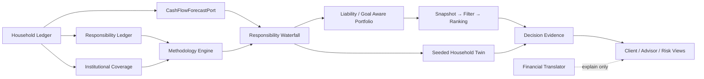

# Fortune Copilot V4 架构

## 目标结构

V4 是在现有 FastAPI、SQLAlchemy、React 和确定性引擎之上的增量升级，没有替换原有审计、工作流、可信 AI 或报告能力。



## 新增能力

- `services/methodology`：加载方法论宪法、地区门槛、市场、养老金、房地产和数据治理快照，并生成证据。
- `services/public_data`：校验官方域名、统计口径与版本化 CPI／最低工资／政策快照，向 PPH 和决策证据提供只读公共数据。
- `services/integrations`：声明 IAM、授权、CDD/AML、账务、制度账户、产品、交易、CRM、投研与渠道 Port；默认适配器严格失败关闭。
- `services/planning/cashflow.py`：当前固定规则与生产 `CashFlowForecastPort` 契约。
- `services/protection_planner`：保障需要、缺口、成本和待报价状态。
- Responsibility Ledger：兼容现有 Goal，并通过独立 `responsibilities` 表为未来责任扩展保留结构。
- Institutional Coverage：汇总社保、公积金、企业/职业年金和个人养老金，输出养老底线覆盖状态。
- Portfolio：按责任违约、流动性缺口、CVaR/回撤、目标/购买力成功、费用/换手的层次顺序选择候选；保留确定性网格求解和版本化降级。
- Product：受控目录携带风险、费率、期限、锁定、本金损失、可售状态、渠道和快照信息；陈旧目录禁止可执行建议。
- Twin：新增老人照护、住房价格与地区生活成本场景，继续 seeded、可复现和非收益承诺。

## 五段适当性链

```text
Financial Safety → Customer → Product → Channel → Transaction-Time
```

比赛环境没有真实渠道与交易前接口，因此即使家庭、客户和产品 Gate 通过，也返回 `ESCALATE`，不能伪装成可执行 `PASS`。陈旧产品快照只允许教育性结果。

## 数据库与兼容性

Alembic `0015_fortune_copilot_v4` 增加三维资产标签、锁定/可领取属性、责任账本、方法论与证据版本、产品快照及推荐证据字段。旧字段和 API 继续可读；新增 response 提供明确 PFNW、分母 ID、快照与版本。

## 生产 Port/Adapter

真实工行部署仍需实现 IAM、KYC、CDD/EDD、AML、产品主数据、适当性、渠道可售、交易前检查、订单清算、CRM、投研委员会快照、客户授权数据和 SRE/DR Adapter。仓库中的 CPI、最低工资和监管文件属于经官方公开网页核验的非实时快照；客户、产品、交易与银行内部投研仍只有 Mock 或 fail-closed 契约，不宣称已接入上述系统。
