# Fortune Copilot V5 执行架构

状态：E00—E14 已实现。
迁移基线：`0015_fortune_copilot_v4 → 0016_v5_financial_graph_core → 0017_v5_client_profile_and_needs → 0018_v5_liability_streams_eltc → 0019_v5_persistent_financial_twin → 0020_v5_family_enterprise → 0021_v5_cfs_orchestration → 0022_v5_product_ontology → 0023_v5_decision_evidence_v2 → 0024_v5_retirement_cross_border → 0025_v5_trust_philanthropy → 0026_v5_monitoring_and_triggers → 0027_v5_calibration_registry`。

## 目标

V5 通过增量数据模型把 Fortune Copilot 从一次性规划书扩展为持续理解家庭财富关系的操作系统。当前阶段只建立可靠的新数据底座，不改变 V4 的规划、组合、Twin、行为、审核和八章报告结果。

```mermaid
flowchart LR
    Legacy["V4 Household / Member / Asset"] --> Adapter["E01 additive backfill / runtime adapter"]
    Adapter --> Graph["V5 Financial Graph"]
    Graph --> Profile["E02 Dynamic Wealth Profile"]
    Profile --> Need["Evidence-backed Wealth Needs"]
    Need --> Liability["E03 Liability / ELTC"]
    Liability --> Snapshot["E04 Persistent Twin"]
    Snapshot --> Enterprise["E05 Family–Enterprise Twin"]
    Enterprise --> CFS["E06 CFS / Risk Budget / Orchestrator"]
    CFS --> Product["E07 Product Ontology / Eligibility / Ranking"]
    Product --> Evidence["E08 Decision Evidence V2 / Frozen Replay"]
    Evidence --> Specialized["E09 Retirement / Currency / Family Continuity / Philanthropy"]
    Specialized --> Monitoring["E10 Monitoring / Behavior / Next Best Action"]
    Monitoring --> Dashboard["E11 Dashboard / Advisor Action Center"]
    Dashboard --> Agents["E12 Bounded Financial Agents"]
    Public["Verified public snapshots"] --> Calibration["E13 China Calibration Registry"]
    Calibration --> Liability
    Calibration --> Evidence
    Calibration --> Personas["E14 A-H Canonical Personas"]
    Personas --> Golden["Structural Golden Outcomes"]
    Golden --> Benchmark["9-metric Release Benchmark V2"]
    Graph --> Projection["Compatibility Projection"]
    Projection --> Shadow["Shadow parity diagnostic"]
    Legacy --> Loader["V4 load_household_facts"]
    Loader --> Planning["Planning / Portfolio / Twin"]
    Shadow -. "E01／E02 不接管 V4 生产路径" .-> Planning
```

## Canonical V5 边界

`financial_entities` 表示家庭、个人以及后续可扩展的企业、信托和其他主体；`financial_accounts` 表示账户包装、机构、币种、法域和限制；`positions` 表示逐持仓市值、成本、期限、流动性、用途、风险、法律本金属性和证据；`ownership_edges` 表示主体之间带生效期的关系。

所有新记录继续使用当前项目统一的：

- UUID、币种、估值日、来源、客户确认、乐观版本、创建／更新时间和软删除；
- Decimal／Numeric 金额，不接受二进制浮点货币；
- 家庭对象授权、client／advisor／admin 写权限、敏感删除二次确认和 `AuditEvent`；
- 生产 Mock 产品与真实客户事实隔离。

## Feature flags

| 环境变量 | 默认值 | 当前状态 |
| --- | --- | --- |
| `ENABLE_V5_FINANCIAL_GRAPH` | `false` | E01 完成；独立 Demo 可开启 |
| `ENABLE_V5_CLIENT_PROFILE` | `false` | E02 完成；独立 Demo 可开启 |
| `ENABLE_V5_LIABILITY_ENGINE` | `false` | E03 完成；独立 Demo 可开启 |
| `ENABLE_V5_PERSISTENT_TWIN` | `false` | E04 完成；独立 Demo 可开启 |
| `ENABLE_V5_FAMILY_ENTERPRISE` | `false` | E05 完成；独立 Demo 可开启 |
| `ENABLE_V5_CFS` | `false` | E06 完成；独立 Demo 可开启 |
| `ENABLE_V5_PRODUCT_ONTOLOGY` | `false` | E07 完成；独立 Demo 可开启 |
| `ENABLE_V5_MONITORING` | `false` | E10 完成；独立 Demo 可开启 |
| `ENABLE_V5_AGENTS` | `false` | E12 完成；独立 Demo 可开启 |
| `ENABLE_V5_CALIBRATION` | `false` | E13 完成；独立 Demo 可开启 |

本地开发默认关闭全部 V5 flag，因此原五步客户路径无可见变化。Docker 独立 Demo 开启已验收的 E01—E14 能力；E08 复用既有审批流，E09 复用 `ENABLE_V5_CFS`，E10、E12、E13 分别使用监控、Agent 与校准开关，E11 为受控前端路由与展示层。E14 只增加 Canonical 合成种子、结构性 Golden、发布基准与事件故事，不增加迁移或新业务分支。

## Migration rules

1. V5 从 `0016` 连续编号，`0016` 的 `down_revision` 固定为 `0015_fortune_copilot_v4`。
2. 不删除或重命名 `assets` 等 V4 表；回退 `0016` 只删除四张新表。
3. `0016` 对每个活动家庭建立家庭主体与兼容账户，对每个活动成员建立个人主体与成员关系，对每项活动资产建立带 `legacy_asset_id` 的 Position。
4. 现有数据库测试实际执行 `0015 → head → 0015`，并在升级后验证三类 Demo 的投影差异不超过 0.01 CNY。
5. 新建于 `0016` 之后的家庭通过幂等 runtime adapter 补齐 Graph；重复调用不会复制 legacy position。
6. `0017` 只增加 profile、tag、need 和 priority 四张表，不回填或改写 V4 业务事实；回退到 `0016` 时只删除这四张新表，Financial Graph 保持可读。
7. `0018` 增加责任流和日期化现金流；`0019` 增加家庭快照、财务事件与生活事件账本。
8. `0020` 增加六张家企表并为 Position 叠加可空 `enterprise_id`；`0021` 只增加 CFS 方案、组件和专业转介三张表。
9. `0022` 不重建 Product，只扩展既有表并增加 `product_snapshots`；回退 E07 保留 E06 CFS 和旧产品记录。
10. `0023` 只给 Recommendation／PlanReport 增加可检索绑定和报告证据 JSON；回退 E08 不删除 E07 产品快照或既有审批版本。
11. `0024` 增加制度权益与币种暴露；`0025` 增加家庭延续需要与公益目标。两步迁移不重建 E06 专业转介，也不修改 E08 冻结证据。
12. `0026` 增加监控策略、告警、顾问触发器和行为观察，并给既有 ActionItem 增加可空触发绑定；不创建平行顾问行动表。
13. 每个阶段都有真实 SQLite upgrade／downgrade 往返测试；回退 E10 保留 E09 专业数据、E08 产品快照与决策证据。
14. E11 只调整前端；E12 复用 AgentOrchestrationRun、AgentStepRun、IntakeDraft 和 KnowledgeChunk，不新增迁移。完成 E12 时迁移头保持 `0026`。
15. `0027` 只新增校准数据集与参数两张表；回退 E13 不删除 E12 Agent 运行、E10 监控、E09 专业数据或 E08 决策证据。业务来源版本与统一行版本分开保存。

## LLM authority boundary

Financial Graph、投影、完整性检查、差异诊断和校准参数解析完全由确定性 Python／SQL 逻辑执行。LLM 无权创建市值、成本、风险等级、流动性天数、法律本金属性、客户确认或校准参数，也不能覆盖 Graph integrity 与 CalibrationPort 结果。E12 Intake Agent 只能生成候选草稿；客户确认后的 canonical write 仍由既有受控领域接口承接，不属于 Agent 工具权限。

## Bank integration boundary

`provider_name` 和 `instrument_code` 当前是客户自报或受控数据，不表示已经接入工行账户、持仓、交易、IAM、CRM 或产品系统。生产 Bank Port 未授权时继续 fail closed；前端使用“客户自报”文案，接口拒绝把模拟产品写成非演示客户的正式持仓。

## E01 API

- `GET /api/v1/households/{id}/financial-graph`
- `POST /api/v1/households/{id}/financial-graph/positions`
- `PATCH /api/v1/households/{id}/financial-graph/positions/{position_id}`
- `DELETE /api/v1/households/{id}/financial-graph/positions/{position_id}`

GET 响应带 V5 `meta`、四类图记录、完整性状态和 V4 投影差异诊断。写操作要求估值日、来源与明确确认；DELETE 还要求 `X-Confirm-Action: delete_financial_graph_position`。

## E02 API

- `GET /api/v1/households/{id}/client-profile`
- `POST /api/v1/households/{id}/client-profile/recalculate`
- `GET /api/v1/households/{id}/wealth-needs`
- `POST /api/v1/households/{id}/wealth-needs/recalculate`

E02 从 `HouseholdFacts`、Financial Graph、风险评估、行为评估、目标与家庭责任生成版本化画像。`profile_hash` 覆盖完整输入、图版本、分析日和规则版本；事实不变时复用同一画像，事实变化时保留旧快照并生成新版本。客户页面只展示事实解释、风险边界、财富需求和资料缺口，不直接展示内部标签代码。

E03—E14 的详细输入、数据模型、API、权限和验收结果分别见责任／ELTC、持久孪生、家企孪生、CFS、产品本体、Decision Evidence V2、Specialized CFS、持续监控、前端 Dashboard、受限 Agent、中国校准与异构 Persona 发布专项文档。

## 当前限制

- V4 planning／portfolio／twin 仍由原 `load_household_facts()` 路径驱动；V5 E01—E14 都是独立、可关闭的增量能力。E13 只为购买力 V2、报告和证据增加可追溯校准层，缺少参数时明确降级。
- 新增但尚未与 V4 汇总资产对账的 Position 不会静默改变当前规划金额，避免双重计入。差异会进入 diagnostic，后续应通过显式对账流程处理。
- E13 当前只有受控演示与经核验公开快照，没有银行授权样本、实时 API 或生产凭据；`bank_authorized` 必须保持不可用，直至完成合同、授权、数据治理与独立验证。
- E14 的 A-H、Golden 和九项基准都只证明本地合成回归；它们不代表中国家庭分布、真实客户效果、投资业绩或银行生产质量。
