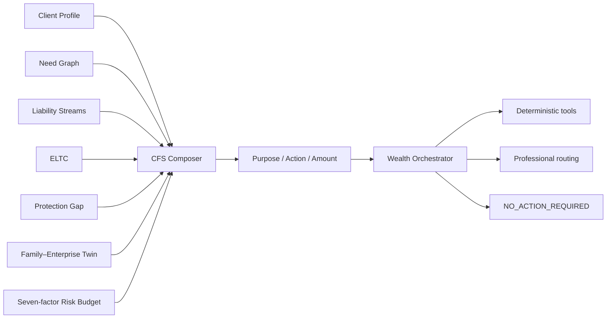

# V5 家庭综合财务方案与 Wealth Orchestrator

## 边界

E06 把家庭需要、责任现金流、长期可配置资本 ELTC、保障缺口、家企暴露和风险评估合成一份可版本、可重演的 Comprehensive Financial Solution（CFS）。它先确定目的、金额、允许风险、确定性工具和专业服务路由，不在 E06 生成基金代码、产品候选池或交易动作。

LLM 只能解释已确定的结果、起草沟通或选择受控工具；不得改写需求优先级、ELTC、Risk Budget、CFS 金额、适当性或专业复核状态。

## 数据模型

迁移 `0021_v5_cfs_orchestration` 在 E05 之后增加三张表：

- `cfs_solutions`：家庭、画像、来源快照、方案版本、需求集合哈希、风险预算版本、方法版本、摘要和决策哈希。
- `cfs_solution_components`：需求、组件类型、优先级、目标／最低金额、期限、行动、产品映射边界、专业复核、状态与证据。
- `professional_service_referrals`：家庭、方案、组件、专家类型、触发原因、紧急度、截止日、状态与证据。

组件类型受控为 `liquidity`、`debt`、`protection`、`housing`、`education`、`retirement`、`investment`、`enterprise_risk`、`cross_border`、`succession`、`trust`、`philanthropy`、`professional_service` 和 `no_action`。专业路由受控为私行、投资、养老、保障、跨境、信托、法律税务与公益八类。

所有记录继续使用 UUID、Decimal／Numeric、币种、估值日、来源、用户确认、乐观版本、时间戳、软删除和审计事件。同一家庭的 `decision_hash` 唯一，事实与规则未变时幂等返回原方案。

## 正式家庭风险预算

Risk Budget 不等同于问卷的 R1–R5。引擎必须同时处理七项因子：

1. 风险承担能力；
2. 风险承担意愿；
3. 行为承受上限；
4. 现有经济权益暴露；
5. 流动性安全垫；
6. 刚性责任缺口；
7. 最短责任期限。

经济权益暴露联合证券权益、未上市企业股权、雇主股和股权激励。流动性缺口会把经济风险能力压低；刚性责任占比较高时向下收紧一级；三年内的责任资金不承担较高波动。只有 ELTC 全部资格门通过、家企风险未封锁新增权益，且风险上限高于现有暴露时，`additional_risk_allowed` 才为真。

## NO_ACTION_REQUIRED

`NO_ACTION_REQUIRED` 是正式组件状态，不是空结果。当 ELTC 不为正、高息债务待修复、现金流安全门不通过、适当性失效或家企暴露封锁新增风险时，长期增长需求转为 `no_action`：

- 保留原长期需求目标金额，说明延后的对象与量级；
- `product_mapping_allowed=false`；
- Wealth Orchestrator 路由到 `no_action` 工具并标记 `blocked`；
- 不生成“0 元投资组合”，不用产品占位。

## Wealth Orchestrator

Orchestrator 从已持久化 CFS 组件生成结构化步骤：`purpose → allowed risk → deterministic tool → status → output`。安全类需求只允许较低风险；近期目标不高于中低；专业复核组件不自动执行；无行动组件正式阻断。

当前可路由的确定性工具包括家庭财务健康、责任流日历、保障规划、养老规划、资金瀑布、组合优化器、家企财富孪生、专业服务路由和无新增行动。“组合优化器”在 E06 只表示已通过的长期配置可进入现有确定性规划工具；E07 已在其后增加独立产品本体、资格与候选层，实时可售仍须生产集成核验。

## API、权限与客户界面

- `POST /api/v1/households/{id}/cfs-solutions`
- `GET /api/v1/households/{id}/cfs-solutions/{solution_id}`
- `POST /api/v1/households/{id}/cfs-solutions/{solution_id}/recalculate`
- `POST /api/v1/households/{id}/professional-referrals`

四个接口都执行家庭对象授权并受 `ENABLE_V5_CFS` 控制。生成、重算和人工转介只允许 client、advisor 和 admin，且分别要求敏感操作确认头。

`/wealth/cfs` 以“需要 → 优先原因 → 行动 → 金额 → 风险预算 → 工具 → 专业服务”呈现。页面不会在没有客户确认时自动生成方案，对已保存方案只使用 ID 回读，不在浏览器重算金融结论。

## 验收结果与当前限制

- 家庭 B：高息债务优先，包含债务组件和正式 `NO_ACTION_REQUIRED`，不生成 investment 组件。
- 风险预算开放的退休准备家庭：同时包含 protection、retirement 和金额为正的 investment 组件。
- 家企案例：1700 万元企业股权、多币种与传承复杂度同时生成 enterprise risk、cross-border 和 succession，并路由私行、跨境和法律税务专家。
- 当前 CFS 从当前已确认快照生成。E07 已将通过映射闸门的组件连接到 0—N 候选；历史快照的方案审批、变更工作流和 Twin 内的 CFS diff 属于 E08。
