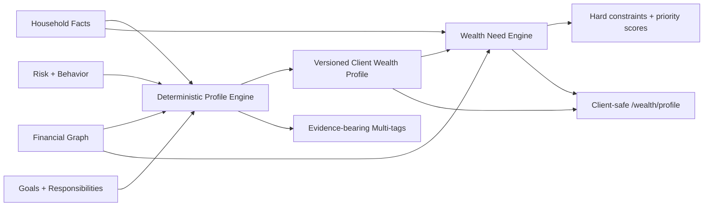

# V5 动态客户财富画像与财富需求图谱

## 边界

E02 把已授权家庭事实整理为可追溯的规划画像，不是银行营销分群。它不读取 `demo_profile` 选择人物模板，不推断敏感身份，不让 LLM 计算金额或优先级，也不直接推荐产品。V4 规划、组合、Twin 和八章报告继续走原路径。

## 数据流

## 数据模型

迁移 `0017_v5_client_profile_and_needs` 新增：

- `client_wealth_profiles`：画像版本、输入快照、生命周期、财富层级、服务复杂度、三类风险边界、企业／跨境／传承复杂度、养老阶段、完整度、资料缺口、哈希、规则／公式版本和状态。
- `client_profile_tags`：一个画像可有多个标签；每项保留类别、置信度、严重度、来源记录 ID 和阈值证据。
- `wealth_needs`：受益主体、目标／最低金额、起止日、刚性、优先级、准备状态、置信度、专业复核、来源与证据。
- `wealth_need_priorities`：一项需求一个确定性排序记录，保留硬约束、分数、原因和规则版本。

所有表沿用 UUID、Decimal／Numeric 金额、币种、估值日、来源、客户确认、乐观版本、时间戳、软删除和审计事件。

## 画像计算与失效

输入哈希覆盖完整 `HouseholdFacts`、Financial Graph 的主体／持仓／所有权及其版本、分析日、规则版本和公式版本。相同输入重复计算时返回已有活动画像；任一事实、图版本或受控计算版本变化时，旧画像转为 `superseded`，新画像递增 `profile_version`。输入回到历史状态时仍可形成新的版本，不使用哈希唯一约束阻止合法历史重现。

资料完整度按成员、收入、资产、支出、风险、行为、目标／责任七个域计算。缺少资料时返回具体缺口和补充动作，并把画像状态设为 `needs_review`；前端不自行补算。

标签由年龄、家庭阶段、职业、收入结构与稳定性、净资产、房产／单一股票集中度、企业与股权激励、养老金、多币种和家庭责任等事实组合产生。`young_worker`、`middle_class_family`、`high_income_professional`、`founder`、`scientist`、`retiree` 是规则结果，不是互斥 persona；同一家庭可同时满足多个标签。

## 财富需求

规则字典覆盖 14 类需求：流动资金、应急、债务偿还、医疗保障、身故保障、教育、住房、退休、长期增长、企业集中、币种匹配、传承、信托和公益。引擎只在事实触发时建立相应需求，不为凑齐类型而虚构目标。

安全与刚性责任优先。流动资金、应急、债务、医疗和身故保障属于硬约束；目标期限、刚性、资料置信度和受控规则分数共同决定最终顺序。企业集中、币种匹配、传承、信托和公益会明确标记专业复核，状态不等于产品建议。

## API 与权限

- `GET /api/v1/households/{id}/client-profile`
- `POST /api/v1/households/{id}/client-profile/recalculate`
- `GET /api/v1/households/{id}/wealth-needs`
- `POST /api/v1/households/{id}/wealth-needs/recalculate`

所有接口先执行家庭对象授权。GET 可供已授权角色查看；重新计算只允许 client、advisor 和 admin。功能开关关闭时统一返回不泄露资源状态的 404。规则路径由 `CLIENT_PROFILE_RULES_PATH` 控制，规则文件必须通过严格结构和全 NeedType 覆盖校验。

## 客户界面

`/wealth/profile` 展示家庭阶段、收入职业、资产负债、目标责任、风险能力、风险意愿、行为上限、已排序需求和资料缺口。页面不显示原始标签代码或内部证据 JSON；刷新只调用后端重算，金额和排序不在浏览器重建。桌面与手机均提供 loading、error、empty／complete 和专业复核状态。
