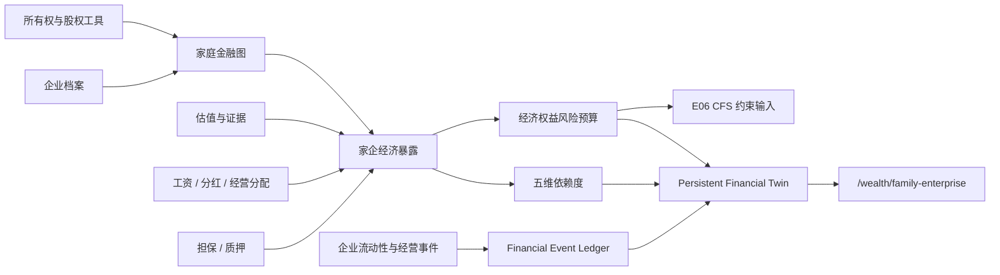

# V5 家庭—企业财富孪生

## 边界

E05 把家庭成员持有或依赖的企业纳入同一份经济财富与风险预算。系统联合观察企业股权、上市雇主股、股权激励、工资／分红、担保、质押、币种与流动性事件，回答“家庭对企业的依赖有多深、还能否承受新增权益风险”。

Enterprise–Household Dependency Score 是内部财富规划指标，不是监管评级、征信评分、授信结论或企业估值意见。估值、事件概率和来源置信度必须显式记录；系统不调用或伪造实时汇率，不把计划 IPO、解禁或股权出售当作已到账现金。

## 数据流

## 数据模型

迁移 `0020_v5_family_enterprise` 在 `0019` 之后叠加六张表，并扩展既有 Graph Position：

- `enterprise_profiles`：企业名称、行业、阶段、司法辖区、上市状态与企业类型。
- `enterprise_ownerships`：家庭金融实体到企业的所有权／投票权、股权工具、归属日与限售日。
- `enterprise_valuations`：估值日、权益价值、估值方法、证据置信度、来源类型与证据载荷。
- `enterprise_cashflows`：家庭成员从企业取得的工资、分红、经营分配或管理费，以及频率与稳定性。
- `enterprise_guarantees`：保证类型、额度、未偿暴露与到期日。
- `enterprise_liquidity_events`：融资、IPO、限售期届满、股权出售、分红变化、估值变化、担保变化和现金流恶化的日期、估值、概率、锁定与状态。
- `positions.enterprise_id`：可空企业关联，用于区分普通证券持仓、上市雇主股、股权激励与质押企业权益。

所有记录继续使用 UUID、Decimal／Numeric、币种、估值日、来源、客户确认、乐观版本、时间戳、软删除与审计事件。家庭 ID 同时保存在子表上，所有读取和写入均执行对象级家庭边界校验。

## 依赖度与经济资本

受控规则 `family_enterprise_v1.json` 将五个组件组成依赖度：

| 组件 | 当前权重 | 分子／分母 |
| --- | ---: | --- |
| 财富依赖 | 40% | 家庭持有企业价值／家庭经济财富 |
| 收入依赖 | 35% | 企业工资、分红与经营分配／收入依赖分母 |
| 担保依赖 | 15% | 未偿企业担保／家庭经济财富 |
| 质押依赖 | 7% | 已质押企业持仓／相关金融资产 |
| 币种依赖 | 3% | 非家庭记账币种企业权益／企业财富 |

组件比率和加权分数都由 Decimal 确定性计算，权重必须合计 1；规则语义版本与公式版本进入 `RuleVersion` 和输入哈希。当前内部演示规则以 0.60 作为高依赖起点，但该阈值不对外宣称为行业或监管标准。

经济权益风险暴露分别统计未上市企业股权、上市雇主股、股权激励与普通证券权益。风险容量只决定总经济权益暴露的内部上限；高家企依赖会阻止新增权益风险。因而“证券账户股票少”不会推导出“权益风险低”，也不会机械提高可配置股票额度。

## 事件、快照与幂等性

估值、分红、低稳定性现金流、担保与流动性事件在客户确认后写入 `financial_events` 的 `enterprise` 域。事件保存企业、金额、币种、生效日、来源引用与规范化哈希；同一输入重放复用已有事件和快照，不重复增加企业、暴露或快照。

每次实际变更按以下顺序处理：

1. 保证变更前 Persistent Financial Twin 基线存在。
2. 在家庭金融图中建立企业实体与家庭所有权边。
3. 幂等写入估值、收入、担保和流动性记录。
4. 创建企业域 Financial Event，并重算家企依赖度与经济权益风险预算。
5. 强制生成新 Household Snapshot，将依赖度、经济权益暴露、剩余容量和 CFS 约束写入 `risk_budget`。
6. 将事件绑定目标快照并记录审计证据。

## API、权限与客户界面

- `POST /api/v1/households/{id}/enterprises`
- `POST /api/v1/households/{id}/enterprise-exposures`
- `GET /api/v1/households/{id}/family-enterprise-view`

接口受 `ENABLE_V5_FAMILY_ENTERPRISE` 控制并执行家庭对象授权。写入只允许 client、advisor 和 admin；除请求体 `is_user_confirmed=true` 外，创建企业和暴露分别要求 `X-Confirm-Action: create_enterprise` 与 `create_enterprise_exposure`。

`/wealth/family-enterprise` 展示 Household Wealth、Enterprise Wealth、Income Dependency、Guarantees、Concentration、Liquidity Events 和 CFS Implications。前端只展示后端的确定性结果；资料为空或服务失败时不生成模拟企业、估值或依赖分数。企业事件同时在 `/wealth/twin` 的统一事件时间线中显示。

## 验收结果与当前限制

- Hero 家庭由 300 万金融资产、500 万房产、1700 万未上市企业股权、60 万企业工资／分红和 500 万创始人担保组成，依赖度为 65.2%，结果是“高 Enterprise Dependency”。
- 普通证券权益为 0，但经济权益暴露为 1700 万；风险预算明确返回“不建议新增权益风险”，没有因证券账户股票少而增加股票空间。
- 首次写入形成估值变化、分红变化、担保变化和 IPO 四条企业事件，并生成一个新快照；完全相同载荷重放后仍为 1 家企业、4 条事件、2 个快照。
- CFS Composer 已在 E06 实现；E05 的家企依赖、经济权益暴露、担保和币种约束现已进入 CFS Risk Budget 与专业路由。E07 产品本体只会处理通过 CFS 映射闸门的组件，不会绕过这些家企约束。
- 当前没有企业估值源、银行客户系统、交易系统或实时 FX 集成；所有演示资料均为已标明来源的合成或用户确认数据。
