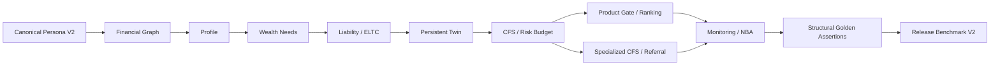

# V5 异构 Persona 与发布基准

状态：E14 已实现
软件版本：`0.14.0`
数据版本：`synthetic-v5-personas-v2.0.0`
迁移：无；沿用 `0027_v5_calibration_registry`

## 发布边界

E14 用八类合成 Persona 验证 V5 的结构完整性、跨模块一致性和事件重算能力。它不是客户研究、投资回测、生产 SLA、模型认证或银行验收，不代表中国家庭总体分布。关键金额仍由确定性服务计算；Golden Outcomes 不写死最终规划金额。

所有 Persona 共用一条 Canonical 管线：

业务服务不读取 Persona 代码来选择路径。D、E、F 的企业数据通过稳定成员／企业名称引用解析为 Canonical UUID，再写入既有 Financial Graph 与 Family–Enterprise 表；重复加载不会复制家庭、企业或暴露。

## Persona 矩阵

| 代码 | 原型 | 主要验证焦点 |
| --- | --- | --- |
| A | 刚工作的个人／新市民 | 小额现金、租房、信用卡、应急、保障、首套房、养老金、ELTC、投资教育 |
| B | 上海双职工中产家庭 | 房贷、教育、赡养、保险、个人养老金、养老、目标冲突、投资 |
| C | 高收入专业人士 | 高现金流、碎片化资产、多目标、低效现金、保障、养老金、CFS |
| D | 科创企业创始人 | 未上市企业股权、担保、企业收入依赖、跨境收入、国际教育、传承 |
| E | 科创专家／科学家 | 股权激励、限制性股票、海外合作收入、教育、创业可能、隐性集中风险 |
| F | 多代际高净值家族 | 多代责任、家企、继承、信托需要、公益和专业路由 |
| G | 跨境家庭 | 多币种收入资产、海外教育、汇率错配、养老和跨境专业路由 |
| H | 退休家庭 | 养老金、医疗、长寿、现金流底线、低风险容量和无行动边界 |

`/demo` 继续保留 A／B／C 三家庭动态配置对照，这是 V4 现场剧情的兼容视图；发布清单和 V5 基准以 A-H 八类为准。

## 数据质量契约

- 粒度：一行 Persona 对应一个且仅一个 Household；企业扩展对应一个 Persona 与一个稳定企业名称。
- 唯一性：Persona code、Household code 和同家庭企业名称均唯一；V2 必须精确包含 A-H。
- 完整性：八类都必须包含家庭、成员、同意记录、资产负债、收入支出、目标、风险与行为输入；相关类型另含保单、社保、币种或企业暴露。
- 引用完整性：成员、所有人和企业引用必须能在当前 Persona 内解析；悬空引用在种子写入前失败。
- 来源边界：V2 只接受 synthetic 数据；估值日、数据版本、确认状态和币种随 Canonical 记录保存。
- 幂等性：第二次加载跳过八个既有家庭，并复用既有企业档案与暴露，不产生重复业务事实。

## Structural Golden Outcomes V2

Golden 文件使用 `path + operator + expected` 断言已计算产物，支持相等、包含、全集包含、上下界、真值和非空等结构判断。断言覆盖：

- 画像完整度和关键标签；
- 需要／责任／CFS 组件类型；
- ELTC 与额外风险门禁；
- 企业依赖、家庭流动性隔离和经济权益暴露；
- 养老、跨境、信托、公益与专业路由；
- Monitoring 预期告警和正式 `NO_ACTION_REQUIRED`。

D 的发布硬约束是高家企依赖、企业集中需要、家庭流动性隔离、企业风险 CFS 和不得新增权益风险。所有金额由当前事实与规则重新计算，Golden 不保存“最终应为某个固定金额”的答案。

## Release Benchmark V2

| 指标 | 方向 | 阈值 | 含义 |
| --- | --- | ---: | --- |
| Profile completeness | 越高越好 | 1.00 | 八类画像均达到 Golden 完整度 |
| Wealth-need coverage | 越高越好 | 1.00 | 结构性需要断言全部通过 |
| CFS coverage | 越高越好 | 1.00 | 每类产生适用 CFS 或正式无行动 |
| No-action correctness | 越高越好 | 1.00 | 无行动状态与 Golden 一致 |
| Product ranking conflict independence | 越高越好 | 1.00 | 注入渠道激励前后排序与买方得分不改善 |
| Advisor trigger precision | 越高越好 | 0.95 | 触发类型落在 Persona 的预期集合内 |
| Invalid alert rate | 越低越好 | 0.05 | 非预期告警占比上限 |
| Decision replay | 越高越好 | 1.00 | 冻结证据哈希可重演 |
| Financial correctness | 越高越好 | 1.00 | 资产负债、现金流和资源守恒恒等式成立 |

基准服务先只重置合成记录，加载 A-H，再以同一循环调用通用业务服务。每项输出实际值、阈值、方向和通过状态；任何 Persona 或指标失败都会使整体发布状态失败。

## 创始人融资事件 14 阶段

1. 加载 D；2. 建立初始 Twin；3. 应用融资事件；4. 生成新快照；5. 验证 Profile hash 变化；6. 验证 Need profile hash 变化；7. 验证经济暴露与风险预算变化；8. 产生家企顾问 Trigger；9. 完成 100 路径 Scenario Lab；10. 生成新 CFS；11. 完成产品组与专业路由；12. 顾问复核；13. 合规批准与客户确认；14. 固化最终确认快照。

融资事件把企业估值从 3000 万元改为 5000 万元、创始人持股从 80% 稀释至 62%。事件链验证家庭经济权益随事实变化，但高企业依赖下仍不得机械增加权益风险。产品映射允许正式返回 `NO PRODUCT`；法律、税务、跨境和私人银行事项进入专业转介，不伪装为系统已经给出专业意见。

## 运行入口

- `POST /api/v1/demo/v5/release-benchmark`，确认短语 `run_v5_release_benchmark`。
- `POST /api/v1/demo/v5/founder-story`，确认短语 `run_founder_story`。
- `scripts/acceptance_check.py --reset-demo` 在本机黑盒验收中同时调用两条链。

两个接口只允许 Demo 管理员，且只删除／重建 `is_synthetic=true` 数据；production 禁用。数据、Golden 与阈值分别位于 `data/synthetic/v5_personas/personas_v2.json`、`data/synthetic/v5_personas/golden_outcomes_v2.json` 和 `data/benchmarks/v5_release_v2.json`。
