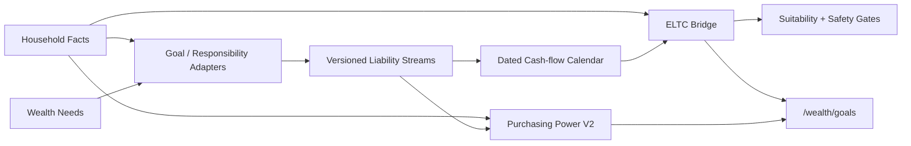

# V5 责任现金流、ELTC 与购买力 V2

## 边界

E03 把家庭目标和责任转换为有日期、有金额、有准备金来源的责任现金流，再按固定顺序计算 Eligible Long-Term Capital（ELTC，长期可配置资本）。ELTC 是长期配置的金额上限，不是收益承诺。V4 的地区启动线保留为客户沟通与偏好参考，但不再决定投资资格；LLM 不参与现金流、扣减、资格或购买力指标计算。

## 数据流

## 数据模型与幂等性

迁移 `0018_v5_liability_streams_eltc` 只新增两张表：

- `liability_streams`：来源目标／责任、受益主体、起止日、频率、基准与最低金额、成本指数、增长假设、刚性、可延期、准备金来源、备选动作和流版本。
- `liability_stream_cashflows`：每期到期日、目标金额、最低金额、序号和计算版本。

目标和责任仍是事实源。适配器以来源记录、版本、金额、日期、增长率和规则版本生成稳定 `stream_version`；相同输入重复读取会复用现有流，事实变化时原记录增量更新并重算现金流，来源删除时软删除派生记录。所有创建、重算和失效均进入审计事件。

教育目标默认拆为四期年度现金流。适配器先反解首期金额，使各期按目标自身增长率递增后的合计仍等于目标总额；最后一期执行分币尾差修正。其他现有目标和责任默认保留原到期日及一次性口径。自定义责任流必须由 client、advisor 或 admin 明确确认，并同时提供 `X-Confirm-Action: create_liability_stream`。

## ELTC 扣减桥

起点是未质押、可投资类别的金融资源。系统按下列固定顺序逐项扣减，每步都返回扣减前金额、申请扣减、实际扣减、扣减后金额、未覆盖缺口、来源和原因：

1. 经营性流动资金：必要支出的 1 个月周转。
2. 应急储备：必要支出的 6 个月安全垫。
3. 高息债务修复：全部未偿高息负债。
4. 保障资金：当前有效保单未来 12 个月保费。
5. 短期刚性责任：未来 60 个月刚性责任现金流缺口和合同债务偿付。
6. 已承诺目标资本：已指定用途、不能重复使用的目标／责任准备金。
7. 锁定制度资产：分析日不可领取的养老金及其他制度账户资产。

每步实际扣减不超过当前余额，因此 ELTC 不会为负；未覆盖部分单独保留，不能被后续步骤掩盖。正式长期配置同时要求 ELTC 大于零、适当性资料有效、无待修复高息债务、可持续收入覆盖年度支出。任何一项未通过都返回 `repair_first`，并给出修复原因。

地区增长启动线在响应中明确标记 `deprecated_as_hard_gate=true`、`determines_eligibility=false`。V5 规划瀑布的长期增长金额上限改为 ELTC，不再为未达到固定金额的家庭建立“学习仓”。E03 功能开关关闭时，V4 规划结果和 API 行为保持原样。

## 购买力 V2

- HCI（Household Cost Inflation）：按家庭实际非债务支出及其类别成本增长率加权，观察生活成本压力。
- GCI（Goal Cost Inflation）：逐条责任流保留自身成本指数和年增长率，不把所有目标压成一个 CPI。
- IAI（Income Adequacy Index）：可持续年收入除以必要年支出，状态分为 critical、watch、adequate、comfortable。

最低工资趋势只进入 IAI 的收入追赶辅助观察；它既不作为 CPI 代理，也不进入组合收益门槛。长期购买力说明使用 HCI 与各目标 GCI，不承诺覆盖或超越任何指数。

## API 与客户界面

- `GET /api/v1/households/{id}/liability-calendar`
- `POST /api/v1/households/{id}/liability-streams`
- `GET /api/v1/households/{id}/eligible-capital`

接口均执行家庭对象授权并受 `ENABLE_V5_LIABILITY_ENGINE` 控制；开关关闭时 fail-closed。`/wealth/goals` 只展示后端确定性结果，包括目标时间线、责任现金流日历、资金缺口、ELTC 七步桥、四项资格门和 HCI／GCI／IAI，不在浏览器重算金融结果。

## 兼容与验收

- `0017 → 0018 → 0017` 实际迁移验证只增加／移除两张 E03 表，E02 和 V4 数据保持可读。
- A／B 案例覆盖 ELTC 为正与责任耗尽资源、教育四期、幂等物化、事实变更重算、审计、RBAC、确认头和功能开关。
- V4 合同测试继续冻结 E03 关闭时的规划输出；E03 开启时仅把旧固定启动线降级为参考，并由 ELTC 接管长期资本上限。
