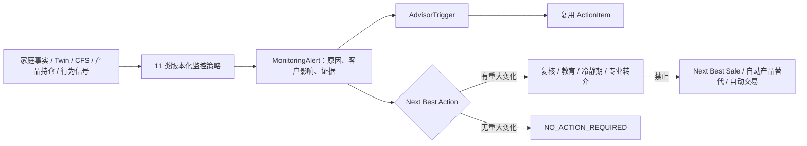

# V5 持续监控、行为观察与 Next Best Action

状态：E10 已实现
迁移：`0026_v5_monitoring_and_triggers`
受控规则：`data/rules/monitoring_v1.json`
Feature flag：`ENABLE_V5_MONITORING`

## 设计目标

E10 把一次性规划结果接入持续复盘，但不把监控变成销售线索生成器。系统从家庭目标、ELTC、风险预算、资产集中、家企依赖、币种责任、持有产品期限、快照时效、退休缺口、生活事件和长期行为信号中识别客户影响，再生成复核、教育、冷静期或专业转介。

## 数据模型

- `monitoring_policies`：按家庭保存策略类型、指标、比较符、阈值、频率、严重度、生效期和规则版本。每个家庭在同一规则版本下恰有 11 类策略。
- `monitoring_alerts`：保存触发原因、客户影响、严重度、建议动作、证据快照、关联财务事件和处理状态。相同策略仍处于打开状态时更新原告警，不重复创建。
- `advisor_triggers`：把告警转为角色、期限和紧急度明确的顾问／合规任务。
- `behavior_observations`：记录追逐表现、恐慌赎回、频繁覆盖、目标频改、提前支取、高频关注和忽视保障七类纵向信号。`risk_limit_effect` 数据库枚举只有 `maintain` 与 `reduce`，没有提高风险上限的状态。
- `action_items`：增加可空 `advisor_trigger_id`、`action_type`、`do_not_sell_flag` 和 `required_specialist`；继续复用原行动生命周期，没有创建 `advisor_actions` 平行表。

## 监控策略

| 策略 | 主要证据 | 输出边界 |
| --- | --- | --- |
| Goal Funding Drift | 目标金额与已准备金额 | 复核金额／期限，不映射产品 |
| ELTC Change | 相邻 CFS 长期投资组件金额 | 重算责任与 ELTC，不沿用旧额度 |
| Risk Budget Breach | 最新 CFS 风险预算 | 暂停新增风险，先修复约束 |
| Asset Concentration | 家庭资产最大单项占比 | 复核来源、用途与处置边界 |
| Enterprise Dependency | 五维家企依赖和经济风险预算 | 发起家庭—企业联合复核 |
| Currency Mismatch | 已归一化原币暴露 | 按责任币种复核，必要时转介 |
| Product Maturity | 家庭 Position 关联产品期限 | 只复核用途／适当性，不自动替代 |
| Snapshot Staleness | 最新 HouseholdSnapshot 日期 | 先确认事实并刷新快照 |
| Retirement Gap | E09 退休收入底线与长寿缺口 | 复核并转养老专业人员 |
| Life Event | FinancialEvent／LifeEvent | 重算家庭事实、责任和目标 |
| Behavior Drift | 七类纵向行为观察 | 教育、冷静期、情景对比或顾问联系 |

阈值、频率、客户影响和动作模板全部来自严格 Pydantic 校验的 JSON。规则必须完整覆盖 11 类策略和 7 类行为信号；缺项、重复或出现“提高风险上限”的效果都会在加载时失败。

## 行为干预复用

当且仅当“市场冲击 + 达阈值行为偏差 + 家庭硬事实无重大变化”同时成立时，监控引擎复用现有 `BehaviorIntervention` 创建教育与冷静期记录。已有完成行为会话时关联该会话；没有时建立不参与原六项实验统计的系统来源会话。原 `/behavior` 画像查询排除这种系统会话，避免监控记录覆盖客户的正式行为实验。

干预只允许维持或下调已有风险上限，内容固定包含原计划／压力情景对比、冷静期和顾问联系，不生成追涨、替代产品或交易指令。

## API 与权限

- `GET /api/v1/households/{id}/monitoring/alerts`
- `POST /api/v1/households/{id}/monitoring/evaluate`
- `GET /api/v1/households/{id}/behavior-interventions`
- `GET /api/v1/households/{id}/next-best-actions`
- `GET /api/v1/advisor/action-center`

家庭读取接口复用对象授权。评估仅允许 advisor／admin，且要求 `X-Confirm-Action: evaluate_monitoring` 与请求体 `is_user_confirmed=true`。请求可引用既有 `CustomerConfirmation`；引擎会验证它属于当前家庭并写入观察、告警和干预证据，绝不把顾问确认伪装成客户确认。行动中心仅允许 advisor／compliance／admin，并按会话家庭授权过滤；E11 才负责把该接口实现为前端工作台。

## NO_ACTION_REQUIRED 与消费者保护

没有达到阈值的重大变化时，NBA 返回正式 `NO_ACTION_REQUIRED` 动作，证据明确 `formal_no_action=true`、`next_best_sale=false`。所有触发动作均为 `do_not_sell_flag=true`，包括产品到期。监控不会：

- 因市场上涨自动输出增加热门基金或追涨动作；
- 因产品到期自动挑选替代品；
- 因行为信号提高客户风险承受上限；
- 自动执行申购、赎回、调仓或换汇；
- 把公开产品、客户画像或家企复杂度转化为销售机会评分。

## 验证契约

- `0025 → 0026 → 0025` 在真实 SQLite 往返，四张监控表和 `ActionItem` 新字段可完整增加与回退；
- 市场冲击与追逐表现信号只生成教育／冷静干预，风险效果为 `reduce`；
- 高家企依赖生成 `family_enterprise_review`，产品到期生成 `product_maturity_review` 且证据标记未生成替代产品；
- 相同输入重放复用原告警、AdvisorTrigger 和 ActionItem；
- 无重大变化返回正式 `NO_ACTION_REQUIRED`；feature flag、二次确认、RBAC 和五个 API 均有覆盖。
