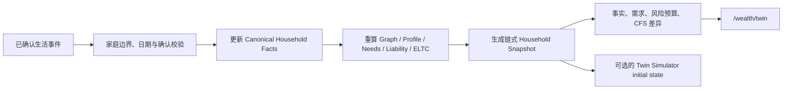

# V5 持久家庭财富孪生与事件账本

## 边界

E04 把家庭当前事实、画像、需求、责任现金流和风险预算固化为可追溯快照，并用事件账本记录已确认的家庭变化。它回答“家庭状态因什么发生了什么变化”，不预测市场，不用 LLM 修改金额、画像、需求或 ELTC。

持久孪生与原有压力模拟器是两个边界：

- Persistent Financial Twin 是版本化、可审计的家庭状态。
- Twin Simulator 是场景分析引擎，可选择某个持久快照作为初始状态。

客户默认界面只呈现状态、变化和时间线，不暴露 Monte Carlo 技术细节。

## 数据流

## 数据模型

迁移 `0019_v5_persistent_financial_twin` 新增三张表，并对现有模拟运行做叠加扩展：

- `household_snapshots`：父快照、来源财务快照、事件游标、Graph／Profile／Need／Liability 版本、完整状态、输入哈希、链式快照哈希和 active／superseded 状态。
- `financial_events`：事件域与类型、生效／记录时间、来源、确认状态、负载、事件哈希和处理后快照。同一家庭的 `event_hash` 唯一。
- `life_events`：事件、可选家庭成员、生活事件类型、事件日期、预期年度财务影响和应用明细。
- `simulation_runs.household_snapshot_id`：可空外键，旧 `snapshot_id` 完整保留。

所有表继续使用 UUID、Decimal／Numeric、币种、估值日、来源、用户确认、乐观版本、时间戳、软删除和审计事件。

## 快照与比较

`build_snapshot()` 将同一分析日的已确认事实及 E01—E03 的确定性结果组成状态。输入未变时复用当前快照；状态变化时递增 `event_cursor`，把旧快照标记为 `superseded`，并用父快照哈希、游标、日期和输入哈希生成新的 `snapshot_hash`。家庭级锁和数据库唯一约束共同处理并发首次物化。

`compare_snapshots()` 比较：

- 年收入、年支出、资产、负债、净资产及每项收入来源；
- 需求的新增／移除、准备状态和目标金额；
- 画像版本与分类字段；
- 风险承受能力、意愿、行为上限、ELTC 和资格门；
- CFS 状态。E06 已在独立方案账本生成当前方案；Twin 内的历史 CFS 变更和审批 diff 等待 E08 工作流集成，不伪造差异。

## 事件处理与幂等性

当前 E04 支持已生效的工资收入调整。写入前必须同时满足请求体 `is_user_confirmed=true` 与 `X-Confirm-Action: create_life_event`；未来日期不会被提前应用。处理顺序是：

1. 校验家庭、成员、工资来源、生效日和显式确认。
2. 以家庭 ID 和规范化请求体生成 `event_hash`。
3. 在更改事实前保证基线快照存在。
4. 只更新选中的、已确认的就业收入来源，并保留每项前后金额和年度影响。
5. 重算画像、需求、责任流和 ELTC，强制生成一个新快照，写入审计证据。
6. 将事件与目标快照绑定后标记为 processed。

同一事件重放时，唯一约束找到已有记录，直接返回已处理快照及比较，`idempotent_replay=true`，不再扣减收入。若进程在“已改事实、未完成快照”之间中断，重放会从已有事件继续收敛，也不会再次应用收入变化。

## 复用原 Twin Simulator

E04 不删除或复制 `services/twin/`。快照内部保存精确的 `TwinModelInput`；发起原模拟时可传入 `household_snapshot_id`。模拟运行固化该 ID，后续 advance 始终从同一历史快照恢复初始状态，即使家庭当前事实已变化也可重演。未传入时完整保留 V4 模拟路径。

## API、权限与客户界面

- `GET /api/v1/households/{id}/wealth-twin`
- `POST /api/v1/households/{id}/life-events`
- `GET /api/v1/households/{id}/event-timeline`
- `GET /api/v1/households/{id}/wealth-twin/snapshots/{snapshot_id}`

所有接口执行家庭对象授权，并受 `ENABLE_V5_PERSISTENT_TWIN` 控制；关闭时 fail-closed。事件写入只允许 client、advisor 和 admin，且要求敏感操作确认头。

`/wealth/twin` 展示 Current State、Event Timeline、Changed Facts、Changed Needs、Changed Risk Budget 和 Changed CFS。金额、状态和差异由后端响应提供，前端不重算金融结论。

## 验收结果与当前限制

- 家庭 B 工资收入下降 30% 时，年收入从 360,000 元降至 252,000 元，画像从 V1 更新为 V2，身故保障目标从 1,800,000 元变为 1,260,000 元，并生成新快照和审计事件。
- 完全相同事件重放后仍为 2 个快照、1 个事件，年收入保持 252,000 元。
- CFS Composer 已在 E06 实现，但只从当前已确认快照生成；历史方案工作流和 Twin CFS diff 在 E08 接入。监测引擎仍在 E11，快照不生成占位警报。
