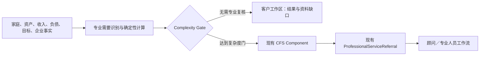

# V5 Specialized CFS：养老、币种、家庭延续与公益

状态：E09 已实现
迁移：`0024_v5_retirement_cross_border → 0025_v5_trust_philanthropy`
受控规则：`data/rules/specialized_cfs_v1.json`

## 设计目标

E09 把养老、跨币种、信托／传承和公益从 CFS 的组件标签扩展为可计算、可追溯的专业工作区，同时保留 E06 的单一协作链。系统负责识别需要、量化缺口和列出资料来源；需要专业判断时，继续复用既有 CFS Component 与 ProfessionalServiceReferral，不建立第二套审批或转介表。

## 数据模型

### `institutional_entitlements`

统一记录社保、企业／职业年金、个人养老金、年金、租金和金融资产提取能力。每条记录包含当前余额、预计年收入、开始年龄／日期、是否保障、是否指数化、锁定属性、置信度与来源证据。引擎从现有事实幂等归一化，不把缴费估算写成经办机构核定待遇。

### `currency_exposures`

按主体、币种、来源类型、方向和期限聚合外币资产、收入、负债、教育责任、企业收入与未来责任。金额保持原币，不调用实时汇率，也不跨币种相加；`source_record_ids` 保留原始记录追溯。

### `trust_succession_needs`

记录未成年受益人、特殊照护、多代家庭、企业延续、权属复杂和保单协同六类触发。输出为 `NO_NEED_DETECTED` 或 `EXPERT_REVIEW_REQUIRED`，只表达需要与资料范围，不输出遗嘱、信托设立、税务或权属结论。

### `philanthropy_goals`

只有已存在的公益 WealthNeed 或家庭明确录入的公益预算才会生成目标。年度预算、目标方向、资金来源、期限、家庭参与和治理偏好作为一等家庭需要进入 CFS；资产规模或客户身份不会自动触发公益标签。

## 确定性计算

### 养老收入底线

退休责任分为基本生活、医疗与长期照护三部分，并与显式养老目标取较高值。输出固定包含：

- `retirement_floor`：退休阶段年度责任底线；
- `guaranteed_income`：已识别保障性制度收入；
- `income_gap`：年度底线与保障收入之差；
- `longevity_gap`：在受控退休年限内的累计缺口；
- `liquidity_gap`：退休前过桥责任扣除可用制度／金融余额后的缺口。

养老金待遇、提取率和退休年限均明确列为测算假设，不构成收益或待遇承诺。

### 币种敞口

引擎识别资产／收入的流入方向和负债／目标的流出方向；期限按当前、短期、中期、长期分桶。`net_exposure` 允许为负，表示该币种未来责任高于已识别流入，不代表应执行换汇交易。达到金额门槛，或存在教育／企业来源时才通过复杂度门。

### 家庭延续与公益

家庭成员年龄、健康风险、家庭代际、企业与权属记录、保单以及显式 WealthNeed 共同组成触发证据。公益只读取客户明确表达。所有复杂专业结论都在边界内转介给养老、跨境、信托、法律税务或公益专业人员。

## API 与权限

- `GET /api/v1/households/{id}/retirement-plan`
- `GET /api/v1/households/{id}/currency-exposures`
- `GET /api/v1/households/{id}/trust-succession-needs`
- `GET /api/v1/households/{id}/philanthropy-goals`

四个读取接口复用 `ENABLE_V5_CFS`、家庭对象授权和 ActorContext。读取时会幂等物化派生记录并写审计；相同输入不会复制记录或虚增版本。响应都包含分析日、数据日、输入哈希、规则／公式版本、确定性来源和专业边界。

## 前端呈现

- `/wealth/retirement`：收入底线、四类缺口、责任拆分、制度权益和养老专家路由；
- `/wealth/global`：按原币汇总、来源明细、责任期限和跨境专家路由；
- `/wealth/family`：只展示已触发的照护／家庭延续与显式公益目标。

三个入口不进入全局产品导航，而是由 `/wealth/cfs` 当前方案组件动态生成。没有 retirement／cross-border／succession／trust／philanthropy 组件时，对应入口不显示；年轻单身家庭不会默认进入“信托中心”。

## 明确边界

- 不提供法律、税务、外汇交易、跨境结构、遗嘱或信托设立意见；
- 不预测汇率，不把不同货币机械折算或加总；
- 不承诺养老金待遇、投资收益或长寿风险结果；
- 不因年龄、财富或职业自动推销信托、保险或公益产品；
- 专业转介表示责任归属和协作状态，不表示专业意见已经完成。

## 验证契约

- `0023 → 0024 → 0025 → 0024 → 0023` 真实 SQLite 往返，E08 ProductSnapshot 与 Decision Evidence 字段保持存在；
- 养老权益、币种桶、家庭需要与公益目标均覆盖幂等和来源失效软删除路径；
- DEMO_A 不默认出现信托需要，DEMO_B 的未成年家庭成员触发专业复核；
- 后端接口覆盖 feature flag、家庭授权、合规只读和边界字段；
- 前端覆盖动态入口、空状态、原币双向展示、专业路由与可访问性。
