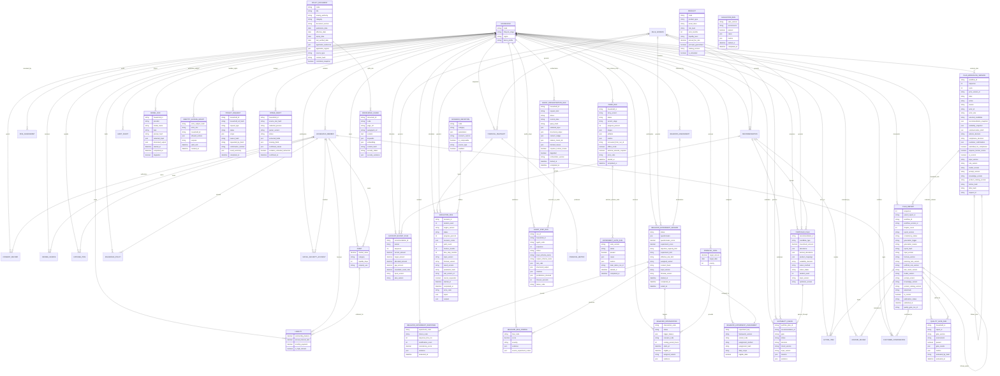

# Fortune Copilot Stage 13 ER 图

下图聚焦聚合关系与外键；所有领域实体还共享 `id`、币种、估值日期、来源、确认状态、版本、时间戳和软删除字段。

```mermaid
erDiagram
    HOUSEHOLD ||--o{ HOUSEHOLD_MEMBER : contains
    HOUSEHOLD ||--o{ CONSENT_RECORD : grants
    HOUSEHOLD ||--o{ INCOME_SOURCE : receives
    HOUSEHOLD ||--o{ EXPENSE_ITEM : spends
    HOUSEHOLD ||--o{ ASSET : owns
    HOUSEHOLD ||--o{ LIABILITY : owes
    HOUSEHOLD ||--o{ INSURANCE_POLICY : holds
    HOUSEHOLD ||--o{ SOCIAL_SECURITY_ACCOUNT : participates
    HOUSEHOLD ||--o{ FINANCIAL_GOAL : pursues
    HOUSEHOLD ||--o{ RISK_ASSESSMENT : assessed_by
    HOUSEHOLD ||--o{ BEHAVIOR_ASSESSMENT : observed_by
    HOUSEHOLD ||--o{ BEHAVIOR_EXPERIMENT_SESSION : participates
    HOUSEHOLD ||--o{ BEHAVIOR_EXPERIMENT_RESPONSE : answers
    HOUSEHOLD ||--o{ BEHAVIOR_BIAS_FINDING : evidences
    HOUSEHOLD ||--o{ BEHAVIOR_INTERVENTION : receives
    HOUSEHOLD ||--o{ BEHAVIOR_EXPERIMENT_ASSIGNMENT : assigned
    HOUSEHOLD ||--o{ FINANCIAL_SNAPSHOT : snapshots
    HOUSEHOLD ||--o{ ACCOUNT_BUCKET_PLAN : allocates
    HOUSEHOLD ||--o{ PORTFOLIO_PLAN : proposes
    HOUSEHOLD ||--o{ SUITABILITY_CHECK : evaluates
    HOUSEHOLD ||--o{ SIMULATION_RUN : simulates
    HOUSEHOLD ||--o{ RECOMMENDATION : receives
    HOUSEHOLD ||--o{ ACTION_ITEM : acts_on
    HOUSEHOLD ||--o{ PLAN_REPORT : documents
    HOUSEHOLD ||--o{ ADVISOR_REVIEW : reviewed_by
    HOUSEHOLD ||--o{ CUSTOMER_CONFIRMATION : confirms
    HOUSEHOLD ||--o{ PLAN_WORKFLOW_VERSION : versions_plan
    HOUSEHOLD ||--o{ AUDIT_EVENT : audits
    HOUSEHOLD ||--o{ MODEL_RUN : traces
    HOUSEHOLD ||--o{ IDENTITY_ACCESS_GRANT : authorizes_subject
    HOUSEHOLD o|--o{ PRIVACY_REQUEST : handles_rights
    HOUSEHOLD o|--o{ QUALITY_GATE_RUN : evaluates_release
    HOUSEHOLD o|--o{ INTAKE_DRAFT : reviews
    HOUSEHOLD ||--o{ AGENT_ORCHESTRATION_RUN : orchestrates
    HOUSEHOLD ||--o{ AGENT_STEP_RUN : audits_steps
    HOUSEHOLD ||--o{ DEMO_RUN : runs_release_story

    HOUSEHOLD_MEMBER o|--o{ CONSENT_RECORD : authorizes
    HOUSEHOLD_MEMBER o|--o{ INCOME_SOURCE : earns
    HOUSEHOLD_MEMBER o|--o{ EXPENSE_ITEM : incurs
    HOUSEHOLD_MEMBER o|--o{ ASSET : owns
    HOUSEHOLD_MEMBER o|--o{ LIABILITY : borrows
    HOUSEHOLD_MEMBER ||--o{ INSURANCE_POLICY : insured
    HOUSEHOLD_MEMBER ||--o{ SOCIAL_SECURITY_ACCOUNT : enrolled
    HOUSEHOLD_MEMBER o|--o{ CUSTOMER_CONFIRMATION : signs

    ASSET o|--o{ LIABILITY : collateral_for
    FINANCIAL_SNAPSHOT ||--o{ FINANCIAL_METRIC : produces
    RULE_VERSION o|--o{ FINANCIAL_SNAPSHOT : governs
    FINANCIAL_SNAPSHOT o|--o{ SIMULATION_RUN : feeds
    RULE_VERSION o|--o{ ACCOUNT_BUCKET_PLAN : governs
    RULE_VERSION o|--o{ RECOMMENDATION : governs
    RULE_VERSION o|--o{ PORTFOLIO_PLAN : governs
    RULE_VERSION o|--o{ SUITABILITY_CHECK : governs
    RULE_VERSION o|--o{ SIMULATION_RUN : governs
    RULE_VERSION o|--o{ BEHAVIOR_EXPERIMENT_SESSION : governs
    SCENARIO_DEFINITION ||--o{ SIMULATION_RUN : defines
    BEHAVIOR_ASSESSMENT o|--o| BEHAVIOR_EXPERIMENT_SESSION : summarizes
    BEHAVIOR_EXPERIMENT_SESSION ||--o{ BEHAVIOR_EXPERIMENT_RESPONSE : records
    BEHAVIOR_EXPERIMENT_SESSION ||--o{ BEHAVIOR_BIAS_FINDING : produces
    BEHAVIOR_EXPERIMENT_SESSION ||--o{ BEHAVIOR_INTERVENTION : triggers
    BEHAVIOR_EXPERIMENT_SESSION ||--|| BEHAVIOR_EXPERIMENT_ASSIGNMENT : assigned_to
    FINANCIAL_GOAL o|--o{ BEHAVIOR_INTERVENTION : grounds
    RECOMMENDATION o|--o{ ACTION_ITEM : creates
    RECOMMENDATION o|--o{ ACCOUNT_BUCKET_PLAN : groups
    RECOMMENDATION o|--o{ PORTFOLIO_PLAN : groups
    RECOMMENDATION o|--o{ SUITABILITY_CHECK : evidences
    PORTFOLIO_PLAN ||--o{ SUITABILITY_CHECK : passes_through
    PLAN_REPORT o|--o{ ADVISOR_REVIEW : reviewed_in
    PLAN_REPORT o|--o{ CUSTOMER_CONFIRMATION : confirmed_in
    PLAN_REPORT o|--o{ ACTION_ITEM : tracks
    PLAN_REPORT o|--o| PLAN_REPORT : follows_parent
    PLAN_REPORT o|--o{ QUALITY_GATE_RUN : gated_by
    PLAN_WORKFLOW_VERSION o|--o{ PLAN_REPORT : snapshots_into
    POLICY_DOCUMENT ||--o{ KNOWLEDGE_CHUNK : splits_into
    AGENT_ORCHESTRATION_RUN ||--|{ AGENT_STEP_RUN : executes_in_order
    PLAN_WORKFLOW_VERSION o|--o| PLAN_WORKFLOW_VERSION : follows_prior
    DEMO_RUN o|--o{ EXPERIMENT_SUITE_RUN : anchors_release_suite

    PRODUCT {
        string code
        string product_type
        string asset_class
        string risk_level
        int term_months
        string liquidity_level
        decimal annual_fee_rate
        boolean principal_guaranteed
        string catalog_version
        boolean is_simulated
    }
    POLICY_DOCUMENT {
        string code
        string title
        string issuing_authority
        string category
        string document_version
        date publication_date
        date effective_date
        date expiry_date
        date last_verified_date
        json applicable_audiences
        json applicable_regions
        string source_type
        string content_hash
        boolean controlled_snapshot
    }
    KNOWLEDGE_CHUNK {
        string document_id
        string code
        string page_ref
        string paragraph_ref
        text content
        json keywords
        json embedding
        string content_hash
        string security_status
        json security_evidence
    }
    INTAKE_DRAFT {
        string household_id
        string source_text_hash
        string redacted_preview
        string parser_version
        string status
        json extracted_fields
        json missing_fields
        json confirmed_values
        boolean contains_untrusted_instruction
        datetime confirmed_at
    }
    AGENT_ORCHESTRATION_RUN {
        string household_id
        string request_kind
        string status
        string current_state
        string query_hash
        json redacted_input
        json structured_output
        json numeric_ledger
        json citation_chunk_ids
        json blocked_issues
        boolean requires_human_review
        boolean degraded
        string orchestrator_version
        datetime started_at
        datetime completed_at
    }
    AGENT_STEP_RUN {
        string run_id
        string household_id
        string agent_code
        int sequence
        string status
        string input_schema_name
        string output_schema_name
        json tool_calls
        json structured_output
        json citations
        json prohibitions_checked
        int timeout_seconds
        string failure_code
    }
    HOUSEHOLD {
        string code
        string lifecycle_stage
        string region
        string demo_profile
    }
    ASSET {
        decimal market_value
        string category
        int liquidity_days
        string property_use
    }
    LIABILITY {
        decimal outstanding_balance
        decimal annual_interest_rate
        decimal monthly_payment
        boolean is_high_interest
    }
    FINANCIAL_GOAL {
        decimal target_amount
        date target_date
        int priority
    }
    ACCOUNT_BUCKET_PLAN {
        string recommendation_id
        string bucket
        int sequence
        decimal current_amount
        decimal target_amount
        decimal allocated_amount
        decimal gap_amount
        decimal investable_asset_ratio
        string input_version
        string plan_version
    }
    PORTFOLIO_PLAN {
        string recommendation_id
        string candidate_type
        decimal investment_amount
        json allocations
        json tactical_allocations
        json product_mappings
        string suitability_decision
        string solver_method
        string solver_status
        int random_seed
        string input_version
        string optimizer_version
    }
    SUITABILITY_CHECK {
        string portfolio_plan_id
        string recommendation_id
        string gate
        string status
        string decision
        string check_version
        string input_version
        json reasons
        json evidence
    }
    SCENARIO_DEFINITION {
        string code
        string category
        json parameters
        string scenario_version
        boolean is_composable
        string source_type
        boolean enabled
    }
    SIMULATION_RUN {
        string scenario_id
        int random_seed
        string engine_version
        string status
        int progress_percent
        json scenario_codes
        int path_count
        int horizon_months
        int time_step_months
        string input_version
        string formula_version
        string result_version
        string parameter_hash
        string rule_version_id
        boolean cancel_requested
        datetime started_at
        datetime completed_at
        string error_code
        json inputs
        json outputs
    }
    BEHAVIOR_EXPERIMENT_SESSION {
        string status
        json questionnaire
        decimal questionnaire_score
        decimal experiment_score
        string objective_capacity_limit
        string experiment_limit
        string effective_risk_limit
        string assigned_variant
        string consent_basis
        string input_version
        string formula_version
        datetime started_at
        datetime completed_at
        datetime exited_at
    }
    BEHAVIOR_EXPERIMENT_RESPONSE {
        string experiment_code
        string choice_code
        int response_time_ms
        int modification_count
        decimal consistency_score
        json evidence
        datetime answered_at
    }
    BEHAVIOR_BIAS_FINDING {
        string bias_code
        decimal score
        string severity
        json evidence
        json source_experiment_codes
    }
    BEHAVIOR_INTERVENTION {
        string intervention_code
        string status
        json trigger_biases
        string scenario_code
        int cooling_period_hours
        datetime starts_at
        datetime eligible_at
        string assigned_variant
        json evidence
    }
    BEHAVIOR_EXPERIMENT_ASSIGNMENT {
        string experiment_key
        string framework_version
        string variant_code
        string assignment_method
        string assignment_hash
        string data_scope
        boolean eligible_data
    }
    PLAN_WORKFLOW_VERSION {
        string workflow_id
        int sequence
        int cycle
        string prior_version_id
        string state
        string action
        string reason
        string actor_id
        string actor_role
        string selected_candidate
        json recommendation_snapshot
        json suitability_snapshot
        text communication_draft
        string advisor_decision
        string compliance_decision
        json customer_confirmation
        boolean submitted_for_compliance
        boolean requires_human_review
        boolean is_current
        string input_version
        string rule_version
        string model_version
        string prompt_version
        string knowledge_version
        string product_catalog_version
        string before_hash
        string after_hash
        string request_id
    }
    PLAN_REPORT {
        int sequence
        string parent_report_id
        string workflow_id
        string workflow_version_id
        int chapter_count
        string report_version
        string consistency_status
        string generation_trigger
        string generation_reason
        string report_hash
        string input_version
        string formula_version
        string planning_rule_version
        string portfolio_rule_version
        string twin_result_version
        string model_version
        string prompt_version
        string knowledge_version
        string product_catalog_version
        string watermark
        boolean is_current
        string publication_status
        datetime published_at
        string quality_gate_run_id
    }
    IDENTITY_ACCESS_GRANT {
        string actor_subject_hash
        string actor_role
        string household_id
        json allowed_actions
        string purpose
        datetime valid_until
        datetime revoked_at
    }
    PRIVACY_REQUEST {
        string household_id
        string household_ref_hash
        string request_type
        string status
        json scope
        string reason_hash
        string requested_by_hash
        string confirmation_method
        json result_summary
        datetime completed_at
    }
    QUALITY_GATE_RUN {
        string household_id
        string report_id
        string gate_version
        string environment
        boolean passed
        json gate_results
        json metrics
        string evaluated_by_hash
        datetime evaluated_at
    }
    EVALUATION_RUN {
        string suite_version
        string environment
        boolean passed
        json cases
        json metrics
        datetime started_at
        datetime completed_at
    }
    DEMO_RUN {
        string household_id
        string story_version
        string status
        string current_stage
        int progress_percent
        json stages
        json artifacts
        json metrics
        string recovered_from_run_id
        boolean offline_mode
        boolean external_network_required
        string error_code
        datetime started_at
        datetime completed_at
    }
    EXPERIMENT_SUITE_RUN {
        string suite_version
        string status
        boolean passed
        json cases
        json metrics
        string main_demo_run_id
        datetime started_at
        datetime completed_at
    }
    MODEL_RUN {
        string household_id
        string provider
        string model_name
        string task
        string prompt_hash
        json redacted_input
        json structured_output
        datetime started_at
        datetime completed_at
        boolean degraded
    }
```
