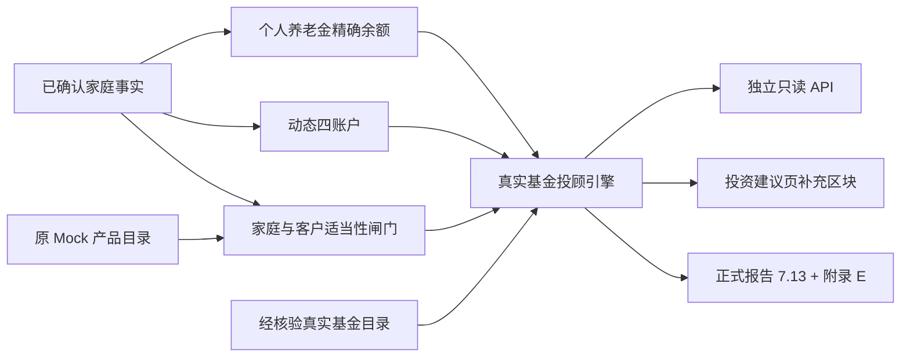

# 真实基金智能投顾补充模块

版本：`fund_advisory_engine_v1.0.0`  
真实基金目录：`mainland_verified_fund_advisory` `1.0.0`  
目录基准日：2026-06-30  
本轮人工核验日：2026-08-07

## 1. 定位与边界

本模块是“投资规划建议”的独立补充层，不改写家庭事实、财务分析、资金瀑布、动态四账户、原三套组合候选或原 Mock 产品映射。它只消费这些已计算结果，并把以下金额进一步映射到真实中国大陆公募基金：

- 要花的钱：优先保持支付流动性，仅允许小比例真实货币基金；
- 保本的钱：这里是资金用途名称，不是产品保本承诺；按最近刚性目标期限在现金、货币、短债和纯债之间分层；
- 个人养老金：只识别可与企业年金分开的个人养老金资金账户余额，只使用证监会最新个人养老金基金名录中的精确份额；
- 生钱的钱：只使用原组合引擎确认的长期可投资金额，权益部分只使用国内宽基指数基金，不使用个股、行业、主题、杠杆或反向产品。

模块不执行交易，不抓取或预测收益率，不以历史排名选基，不把工行官网列示解释为此刻任何客户都可以申购。所有基金均明确为非保本、非保收益。

个人养老金金额是现有账户余额上的专项覆盖，不与四账户建议额相加形成新的家庭可投资本金。企业年金和个人养老金混合记录若无法拆分，系统保持金额为零并要求补录，不猜测可支配余额。

## 2. 数据与证据模型

真实基金目录位于 `data/products/verified_real_funds_v1.json`，与 `mock_products_v1.json` 完全隔离。原 Mock 目录仍服务资产类别教学、组合求解和三道闸门；真实目录只服务基金投顾补充。

每只真实基金必须同时满足：

1. 六位数字基金份额代码；
2. 基金全名、管理人、份额类别、产品类型和赎回/持有边界；
3. 官方产品文件或法定信息披露证据；
4. 标记为工行公开列示时，必须存在工行官方页面证据；
5. 标记为个人养老金可投时，必须存在证监会个人养老金基金名录证据；
6. 权益指数基金必须记录标的指数，并通过 `broad_index=true`、`sector_or_thematic=false`、`leveraged=false`、`inverse=false` 四项硬校验；
7. `principal_guaranteed` 只能为 `false`。

任一条件失败，Pydantic 会拒绝加载整个目录。目录超过人工核验日 45 天后自动标记 `catalog_stale=true`，所有基金分配停止，金额转为现金或守门保留，直到官方证据更新。

## 3. 当前精确产品白名单

| 代码 | 精确份额 | 用途 | 工行公开列示证据 | 个人养老金名录 |
| --- | --- | --- | --- | --- |
| 482002 | 工银瑞信货币市场基金 A | 要花、保本、长期组合稳定器 | 已核验，执行时仍需 App 确认 | 否 |
| 006834 | 工银瑞信尊享短债债券 A | 保本、长期组合稳定器 | 已核验，执行时仍需 App 确认 | 否 |
| 000402 | 工银瑞信纯债债券 A | 保本、长期组合稳定器 | 已核验，执行时仍需 App 确认 | 否 |
| 005102 | 工银瑞信沪深300ETF联接 A | 生钱的钱，国内大盘宽基 | 已核验，执行时仍需 App 确认 | 否 |
| 164809 | 工银瑞信中证500ETF联接 A | 生钱的钱，国内中盘宽基 | 已核验，执行时仍需 App 确认 | 否 |
| 020189 | 建信添福悠享稳健养老目标一年持有期债券型 FOF Y | 个人养老金低风险候选 | 未核验，不进入工行限定分配 | 是 |
| 022935 | 工银瑞信沪深300指数 Y | 个人养老金宽基备选 | 已核验，执行时仍需个人养老金账户内确认 | 是 |
| 022982 | 工银瑞信中证A500ETF联接 Y | 个人养老金宽基备选 | 已核验，执行时仍需个人养老金账户内确认 | 是 |

当前默认不使用 022935 和 022982 配置“个人养老金中的债券基金和货币基金资金”，因为它们是权益宽基，风险用途不匹配。它们只作为精确的高波动备选展示。020189 虽在证监会名录且有其他持牌银行产品文件，但未核验工行当前个人养老金货架，因此默认 `icbc_only=true` 时不分配。

核心官方来源：

- [证监会个人养老金基金名录（截至2026年6月30日）](https://www.csrc.gov.cn/csrc/c101900/c6551799/content.shtml)
- [五部门关于全面实施个人养老金制度的通知](https://www.csrc.gov.cn/csrc/c100028/c7524086/content.shtml)
- [工商银行基金费率一览表](https://www.icbc.com.cn/webpage/fund/rate-list?fundId=482002)
- [工商银行工银货币业务页，代码482002](https://www.sh.icbc.com.cn/ningbo/column/1438058341816746087.html)
- [工银尊享短债006834法定公告](https://media.icbc.com.cn/fund/report/4783507_fcdb.pdf)
- [工银纯债000402法定公告](https://media.icbc.com.cn/fund/report/4873713_fcdb.pdf)
- [工银中证500ETF联接164809更新招募说明书](https://media.icbc.com.cn/fund/report/4320037_fcdb.pdf)
- [工银中证A500ETF联接Y 022982产品资料概要](https://www.icbcubs.com.cn/gyrx-file/20260209/6989b991eac4cb6f58a26dab.pdf)

每只产品的完整来源和字段支持关系保存在 JSON 目录中，也由前端证据折叠区和报告附录 E 展示。

## 4. 确定性配置规则

### 要花的钱

- 目录证据有效：70% 工行活期/支付侧现金，30% 482002；
- 目录过期：100% 现金；
- 不使用债券、权益或有最低持有期的基金。

货币基金快速赎回可能有限额或服务变化，不能替代全部支付现金。

### 保本的钱

系统读取规划引擎中最近一个五年内尚有缺口的目标：

- 3 个月内：70% 现金、30% 482002；
- 4-12 个月：40% 现金、30% 482002、30% 006834；
- 12 个月以上：10% 现金、30% 482002、30% 006834、30% 000402；
- 目录过期：100% 现金。

单只基金上限 30%。短期目标越近，现金越高。名称中的“保本”只说明目标用途，三只基金均不保本。

### 个人养老金

- 只有 `subcategory` 精确为“个人养老金”或“个人养老金账户”的资产才进入金额计算；
- “企业年金与个人养老金”等混合记录不拆分、不估计；
- 默认工行限定模式下，020189 因工行货架未核验而不分配；
- 022935 和 022982 虽同时命中证监会名录和工行公开列示，但与本轮“债券/货币优先”的稳健用途不匹配，仅作备选；
- 非工行限定模式且客户风险至少为 R2 时，020189 最多占 30%，其余 70% 守门保留；这不表示工行可售，也不自动触发开户行变更。

对截至2026-06-30的证监会名录做精确名称检查后，名称含“货币”的基金为 0 只，名称含“债券”的基金为 1 只（020189）。系统不会把普通账户货币/债券基金伪装为个人养老金账户可买产品。

### 生钱的钱

前置条件是原家庭安全闸门通过、真实基金目录有效且客户风险至少为 R2。否则 100% 守门保留，仅展示教育方向。

| 客户审慎上限 | 482002 | 006834 | 000402 | 005102 | 164809 |
| --- | ---: | ---: | ---: | ---: | ---: |
| R2 | 30% | 30% | 30% | 10% | 0% |
| R3 | 20% | 15% | 25% | 30% | 10% |
| R4/R5 | 25% | 10% | 15% | 30% | 20% |

权益部分只由沪深300与中证500两个国内宽基构成。系统不使用行业判断、择时、个股筛选、收益预测或自动交易。

## 5. 架构与调用链

独立模块文件：

- Schema：`backend/app/schemas/fund_advisory.py`
- 目录加载和过期控制：`backend/app/services/fund_advisory/catalog.py`
- 确定性配置：`backend/app/services/fund_advisory/engine.py`
- API：`backend/app/api/v1/endpoints/fund_advisory.py`
- 前端：`frontend/src/components/portfolio/FundAdvisoryWorkspace.tsx`
- 测试：`backend/tests/test_fund_advisory.py`

## 6. API

| 方法 | 路径 | 作用 |
| --- | --- | --- |
| GET | `/api/v1/fund-advisory/products` | 返回真实基金目录、证据和过期状态 |
| GET | `/api/v1/households/{id}/fund-advisory?icbc_only=true` | 返回四种用途的真实基金投顾补充，默认只分配有工行公开列示证据的基金 |

接口是只读确定性计算，不保存交易、不提交申购、不调用运行时网络。正式报告生成时固定使用 `icbc_only=true`。

## 7. 目录更新运行手册

每次更新至少执行：

1. 从证监会下载最新个人养老金基金名录，按六位代码复核新增、移除和份额变化；
2. 在工行官网基金列表按六位代码复核名称，并在工行手机银行人工检查客户可见性、份额类别、风险测评、限购和暂停状态；
3. 从基金管理人或法定信息披露渠道获取最新产品资料概要、招募说明书或存续公告；
4. 只修改真实基金 JSON，不修改原 Mock 目录；更新 `data_date`、`verified_on` 和目录版本；
5. 运行目录、工行限定、个人养老金、报告和前端测试；
6. 由合规/投研人员复核后再发布。

推荐生产阶段把目录维护改造成有审批流的产品主数据服务，并接入工行内部实时货架、TA交易状态、客户风险测评、费率、限购和暂停数据。在这些内部接口接入前，当前模块只能提供“公开证据支持的规划建议”，不能声称完成真实银行交易闭环。
