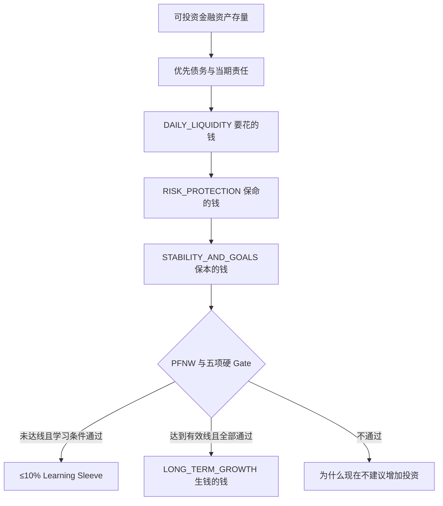

# 中国家庭财富四域责任瀑布

## 计算顺序

四域采用词典序顺序：前一层未满足时，后一层不得用市场观点或收益预期绕过。



## DAILY_LIQUIDITY

比赛规则是 `clamp(月必要支出 × 0.25, 3000, 20000)`，已封装为独立策略。`CashFlowForecastPort` 为未来 14/30 日 P95 净流出、工资日、账单日和周期支出预留接口。信用卡只是支付工具，未使用额度永远不计入资产。

## RISK_PROTECTION

保障规划按医疗、重疾、身故/收入替代、意外及适用的车产责任分别输出需要、已有保障、缺口和年度保费成本。没有真实报价时只返回 `product_quote_required`，不根据缺口虚构保费。保险保额不计入资产，储蓄或年金保险须拆分保障与资金积累属性。

## STABILITY_AND_GOALS

界面继续使用“保本的钱”，内部语义为 `STABILITY_AND_GOALS`。固定声明为：

> “保本的钱”是家庭资金用途名称，不代表账户内所有产品保证本金。

市场战术参考带为：偏积极 5%–10%（7.5% 锚）、中性 10%–20%（15% 锚）、偏防守 20%–30%（25% 锚）。该区间不具约束力，近期刚性责任可使稳定层高于 30%。市场状态来自版本化 `MarketRegimeSnapshot`，客户和 LLM 均不可设置。

## LONG_TERM_GROWTH

正式增长要求 PFNW 达到 `effective_threshold`，并同时通过流动性、债务、保障、期限和适当性 Gate。70% 是长期剩余资源的战略目标：

```text
GrowthRatio = FormalGrowthAmount / residual_long_term_plannable_capital
```

任何硬约束都可让实际比例低于 70%，系统不会为了达标侵占家庭责任。低于启动线时正式增长金额恒为零。

学习仓只在年度结余为正、无待处理高息债务、安全储备已完成、仍有长期剩余资金且适当性通过时开放，上限是该长期剩余资金的 10%。默认仅教育性展示分散宽基，不使用杠杆、期货或单只股票。

## 存量和流量

`CurrentAllocationPlan` 只描述今天已有的资产负债表存量；`ContributionPlan` 只描述未来工资和新增储蓄。两者分别展示，不合并成“当前可配置资金”。年度保费是流量，不与账户存量重复求和。
